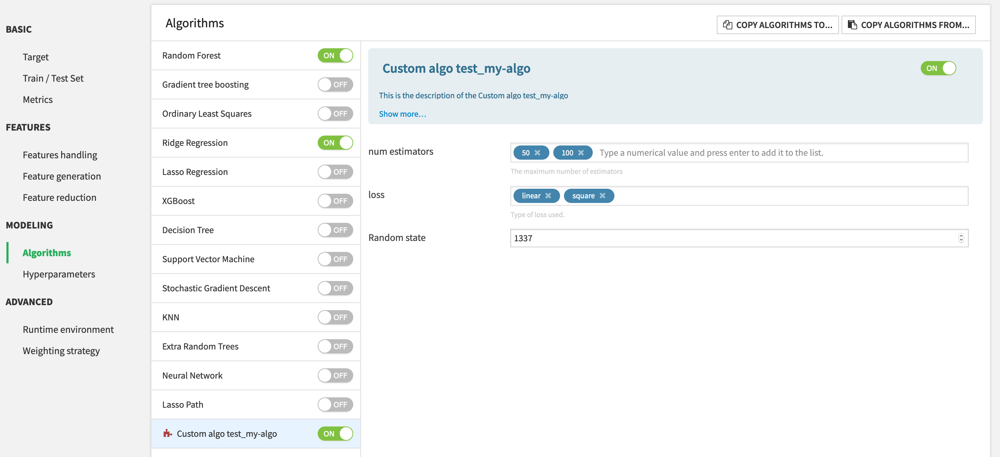

Component: Prediction algorithm
###############################

Dataiku DSS offers a variety of :doc:`algorithms</machine-learning/algorithms/index>` to address :doc:`prediction</machine-learning/supervised/index>` problems.

This plugin component allows to extend the list of available algorithms, in order to help data scientists expose their custom algorithms to other users.

.. contents::
	:local:

First example
=============

To start adding prediction algorithms, we recommend that you use the plugin developer tools (see the tutorial for an introduction). In the Definition tab, click on “+ NEW COMPONENT”, choose ”Prediction Algorithms”, and enter the identifier for your new algorithm. You’ll see a new folder ``python-prediction-algos`` and will have to edit:

* the ``algo.json`` file, containing the various parameters of your algo
* the ``algo.py`` file, containing the code of your algorithm

A basic prediction algorithm's description to add the scikit learn `AdaboostRegressor <https://scikit-learn.org/stable/modules/generated/sklearn.ensemble.AdaBoostRegressor.html>`_ algorithm looks like this:

.. code-block:: json

    {
        "meta" : {
            "label": "Custom algo test_my-algo",
            "description": "This is the description of the Custom algo test_my-algo",
            "icon": "icon-puzzle-piece"
        },
        
        "predictionTypes": ["REGRESSION"],
        "gridSearchMode": "MANAGED",
        "supportsSampleWeights": true,
        "acceptsSparseMatrix": false,

        "params": [
            {
                "name": "n_estimators",
                "label": "num estimators",
                "description": "The maximum number of estimators",
                "type": "DOUBLES",
                "defaultValue": [50, 100],
                "allowDuplicates": false,
                "gridParam": true
            },
            {
                "name": "loss",
                "label": "loss",
                "description": "Type of loss used.",
                "type": "MULTISELECT",
                "defaultValue": ["linear"],
                "selectChoices": [
                    {
                        "value":"linear",
                        "label":"linear"
                    },
                    {
                        "value":"square",
                        "label":"square"
                    },
                    {
                        "value":"exponential",
                        "label": "exponential"
                    }
                ],
                "gridParam": true
            },
            {
                "name": "random_state",
                "label": "Random state",
                "type": "DOUBLE",
                "defaultValue": 1337
            }      
        ]
    }

and the corresponding python code:

.. code-block:: python

    from dataiku.doctor.plugins.custom_prediction_algorithm import BaseCustomPredictionAlgorithm
    from sklearn.ensemble import AdaBoostRegressor

    class CustomPredictionAlgorithm(BaseCustomPredictionAlgorithm):    
        """
            Args:
                prediction_type (str): type of prediction for which the algorithm is used. Is relevant when 
                                    algorithm works for more than one type of prediction.
                params (dict): dictionary of params set by the user in the UI.
        """
        
        def __init__(self, prediction_type=None, params=None):        
            self.clf = AdaBoostRegressor(random_state=params.get("random_state", None))
            super(CustomPredictionAlgorithm, self).__init__(prediction_type, params)
        
        def get_clf(self):
            """
            This method must return a scikit-learn compatible model, ie:
            - have a fit(X,y) and predict(X) methods. If sample weights
            are enabled for this algorithm (in algo.json), the fit method
            must have instead the signature fit(X, y, sample_weight=None)
            - have a get_params() and set_params(**params) methods
            """
            return self.clf

Once the plugin component is added, it will be available in the visual ML Lab, as any other algorithm.

Algorithm description
=====================

Each algorithm description has the following structure:

* ``predictionTypes``: List of types of prediction for which the algorithm will be available. Possible values are: ["BINARY_CLASSIFICATION", "MULTICLASS", "REGRESSION"].
* ``gridSearchMode``: How DSS handles gridsearch. See :ref:`gridsearch`.
* ``supportsSampleWeights``: Whether the model supports or not sample weights for training. If yes, the clf from `algo.py` must have a ``fit(X, y, sample_weights=None)`` method. If not, sample weights are not applied on this algorithm, but if they are selected for training, they will be applied on scoring metrics and charts.
* ``acceptsSparseMatrix``: Whether the model supports sparse matrices for fitting and predicting, i.e. if the ``clf`` provided in `algo.py` accepts a sparse matrix as argument for its ``fit`` and ``predict`` methods.
* ``params``: List of plugin :doc:`parameters </plugins/reference/params>` that can be leveraged by the model, and potentially the grid search (See :ref:`gridsearch`).
* ``meta``: Description of the component. Similar to other plugin components.

Algorithm python object
============================

The ``BaseCustomPredictionAlgorithm`` defines a ``get_clf`` method that must return a *scikit-learn compatible* object. This means that the model must:

* have ``fit(X,y)`` and ``predict(X)`` methods. If sample weights are enabled for this algorithm (in ``algo.json``), the fit method must have instead the signature ``fit(X, y, sample_weight=None)``.
* have ``get_params()`` and ``set_params(**params)`` methods.

Moreover, the model can implement a function called ``set_column_labels(self, column_labels)`` if it needs to have access to the column names of the preprocessed dataset.

For further information, please refer to :ref:`Custom Models <custom.models>`.

Usage of a code-env
===================

DSS allows the user to create and use :doc:`code environments </code-envs/index>` to be able to leverage external packages.

Plugin algorithms cannot use the :doc:`plugin code-env </plugins/reference/other>`. 

If the algorithm code relies on external libraries, a dedicated code-env must be created on the Dataiku DSS instance on which the plugin is installed. This code env must contain both:

* the packages required for Visual Machine Learning
* the packages required for your algorithm

This code env must then be *manually* selected by the end-user running this plugin algorithm.

.. _gridsearch:

Grid search
===========

Plugin models offer the possibility to run grid search, i.e. testing several values for various hyper parameters and taking the ones that yield the best results. To do so, there are two modes of grid search ``MANAGED`` or ``CUSTOM``, which are set by the ``gridSearchMode`` field.

Under the hood, DSS builds the hyperparameter grid out of the params, and for each grid point, it does ``clf.set_params(**grid_point_params)``. Then, DSS handles the optimization using the same :doc:`mechanism </machine-learning/advanced-optimization>` as for the other visual algorithms.

If you do not want to do grid search, you can set ``gridSearchMode: "NONE"``.

Managed grid search
-------------------

For the `MANAGED` mode,  the user needs to define grid params in `algo.json` by setting ``"gridParam": true`` for each grid param. Those parameters are the parameters over which the grid will be built.

Acceptable grid params are arrays, supported values are `STRINGS`, `MULTISELECT`, `ARRAY`, and `DOUBLES`.

For example, to re-implement the :ref:`Extra Random Trees algorithm <regression-classification-extra-random-trees>` with a managed gridsearch plugin algorithm, the description looks like:

.. code-block:: json

    {
        "meta" : {
            "label": "Custom Extra Random Trees",
            "description": "Reimplementation of Extra Random Trees",
            "icon": "icon-puzzle-piece"
        },
        "predictionTypes": ["BINARY_CLASSIFICATION"],
        "gridSearchMode": "MANAGED",
        "supportsSampleWeights": true,
        "params": [
            {
                "name": "n_estimators",
                "type": "DOUBLES",
                "defaultValue": [30],
                "label": "Numbers of trees",
                "description": "Number of trees in the forest.",
                "gridParam": true
            },   
            {
                "name": "max_depth",
                "gridParam": true,
                "type": "DOUBLES",
                "defaultValue": [8],
                "label": "Maximum depth of tree",        
                "description": "Maximum depth of each tree in the forest. Higher values generally increase ..."
            },
            {
                "name": "min_samples_leaf",
                "gridParam": true,
                "type": "DOUBLES",
                "defaultValue": [3],
                "label": "Minimum samples per leaf",        
                "description": "Minimum number of samples required in a single tree node to split this node. Lower values increase ..."
            },
            {
                "name": "n_jobs",
                "type": "INT",
                "defaultValue": 4,
                "label": "Parallelism",        
                "description": "Number of cores used for parallel training. Using more cores leads to faster ..."
            }
        ]
    }

In that case, ``n_jobs`` is not a grid param because it can only take one value.

The ``algo.py`` looks like this:

.. code-block:: python

    from sklearn.ensemble import ExtraTreesClassifier
    from dataiku.doctor.plugins.custom_prediction_algorithm import BaseCustomPredictionAlgorithm

    class CustomPredictionAlgorithm(BaseCustomPredictionAlgorithm):

        def __init__(self, prediction_type=None, params=None):
            # setting non grid-search params
            self.clf = ExtraTreesClassifier(random_state=1337, n_jobs=params["n_jobs"])
            super(CustomPredictionAlgorithm, self).__init__(prediction_type, params)

        def get_clf(self):
            return self.clf

In this case ``ExtraTreesClassifier`` is a scikit learn model, so already has all the required attributes and methods.

Custom grid search (Advanced)
-----------------------------

To do a more complex grid search, you can use the ``CUSTOM`` mode. In that mode, you need to manually build the grid in a ``get_grid`` function of the ``CustomPredictionAlgorithm`` class. It must return either:

1. A dictionary where each key is the name of the param, and each value a **list** of potential values, e.g. ``{ "paramA": [a1, a2], "paramB": [b1, b2] }``, which will get expanded by cartesian product into grid ``a1+b1``, ``a1+b2``, ``a2+b1``, ``a2+b2``.
2. A list of dictionaries with such possibilities: ``[{"withA": false}, {"withA": true, "paramA": [a1, a2]}]``, which will get expanded into grid ``false``, ``true,a1``, ``true,a2``. This is useful when the grid is not just the cartesian product of the parameter values, because some parameters condition others.

To re-implement the :ref:`Logistic regression algorithm <classification-logistic-regression>` used for classification, the algorithm description looks like this:

.. code-block:: json

    {
        "meta" : {
            "label": "Custom Logistic Regression",
            "description": "Reimplementation of Logistic Regression",
            "icon": "icon-puzzle-piece"
        },
        
        "predictionTypes": ["BINARY_CLASSIFICATION"],
        "gridSearchMode": "CUSTOM",
        "supportsSampleWeights": true,
        "params": [
            {
                "name": "l1_regularization",
                "label": "l1_regularization",
                "description": "Try with L1 regularization.",
                "type": "BOOLEAN",
                "defaultValue": true
            },
            {
                "name": "l2_regularization",
                "label": "l2_regularization",
                "description": "Try with L2 regularization.",
                "type": "BOOLEAN",
                "defaultValue": true
            },        
            {
                "name": "C",
                "label": "C",
                "description": "Penalty parameter C of the error term.",
                "type": "DOUBLES",
                "defaultValue": [0.01, 0.1, 1]
            }      
        ]
    }

In this case, parameters are not directly convertible into a grid, so we need to write a ``get_grid`` method like this:

.. code-block:: python
    
    from sklearn.linear_model import LogisticRegression
    from dataiku.doctor.plugins.custom_prediction_algorithm import BaseCustomPredictionAlgorithm

    class CustomPredictionAlgorithm(BaseCustomPredictionAlgorithm):

        def __init__(self, prediction_type=None, params=None):
            self.clf = LogisticRegression(random_state=1337)
            # saving params for further use
            self.params = params
            super(CustomPredictionAlgorithm, self).__init__(prediction_type, params)
    
        def get_clf(self):
            return self.clf
        
        def get_grid(self):
            # retrieving params and manually building the grid
            if self.params is None or len(self.params) == 0:
                return {}
            grid_params = {}
            
            regularization = []
            if self.params.get("l1_regularization", False):
                regularization.append("l1")
            if self.params.get("l2_regularization", False):
                regularization.append("l2")
            if len(regularization) > 0:
                grid_params["penalty"] = regularization
            
            if "C" in self.params.keys():
                c_params = self.params["C"]
                if isinstance(c_params, list) and len(c_params) > 0:
                    grid_params["C"] = c_params
                    
            return grid_params
