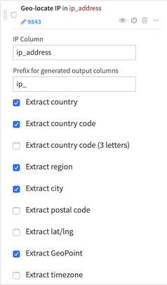
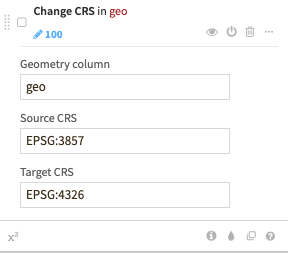

Geographic processors
#######################

.. Keep in sync with /geographic/preparation

The prepare recipe provides a variety of processors to work with geographic information.

For an overview of all geographic capabilities in DSS, please see :doc:`/geographic/index`

DSS also provides a set of formulas to compute geographic operations (see :doc:`Formula language</formula/index>`)

.. contents::
	:local:

Geopoint converters
=====================

DSS provides two processors to convert between a Geopoint column and latitude/longitude columns:

* :doc:`/preparation/processors/geopoint-create`
* :doc:`/preparation/processors/geopoint-extract`

Resolve GeoIP
================

The :doc:`/preparation/processors/geoip` processor uses the GeoLite City database (https://www.maxmind.com) to resolve an IP address to the associated geographic coordinates.

It produces two kinds of information:

* Administrative data (country, region, city, ...)
* Geographic data (latitude, longitude)

The output GeoPoint can be used for :doc:`/visualization/charts-maps`.

Reverse geocoding
==================

Please see :doc:`/geographic/geocoding`

Zipcode geocoding
====================

Please see :doc:`/geographic/geocoding`

Change coordinates system
=========================

This processor changes the Coordinates Reference System (CRS) of a geometry or geopoint column.

Source and target CRS can be given either as a EPSG code (e.g., "EPSG:4326") or as a projected coordinate system WKT (e.g., "PROJCS[...]").

Use this processor to convert data projected in a different CRS to the WGS84 (EPSG:4326) coordinates system.

Compute distances between geospatial objects
============================================

The :doc:`/preparation/processors/geo-distance` processor allows you to compute distance between geospatial objects

Create area around a geopoint
=============================

The :doc:`/preparation/processors/geopoint-buffer` processor performs creation of polygons centered on input geopoints. For each input geospatial point, a spatial polygon is created around it, delimiting the area of influence covered by the point (all the points that fall within a given distance from the geopoint). The shape area of the polygon can be either rectangular or circular (using an approximation) and the size will depend on the selected parameters.

Extract from geo column
=========================

The :doc:`/preparation/processors/geo-info-extractor` processor extracts data from a geometry column:

* centroid point,
* length (if input is not a point),
* area (if input is a polygon).
