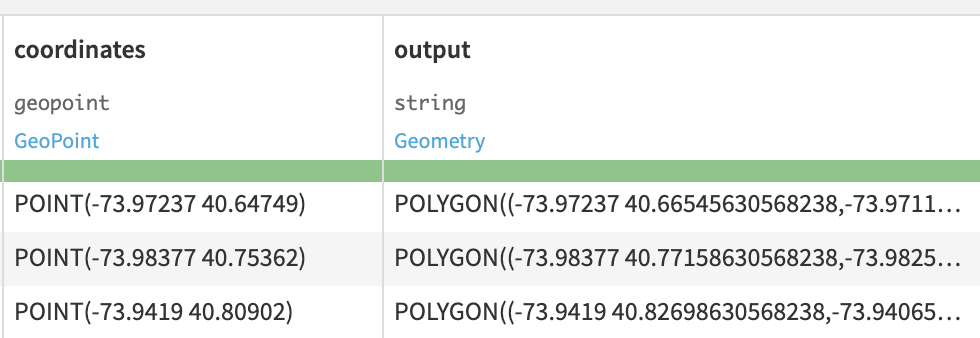
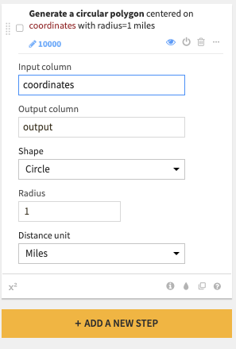
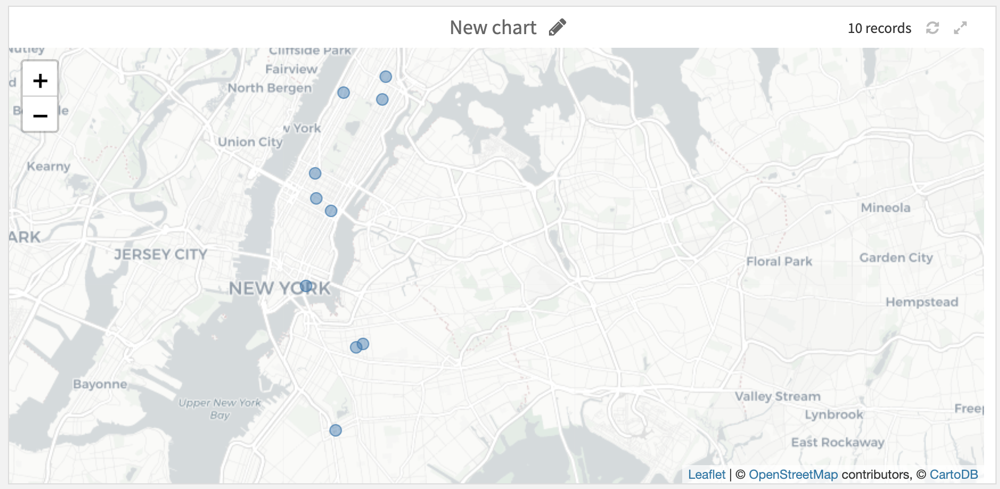
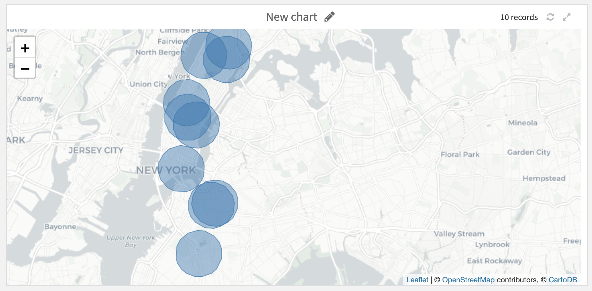

Create area around a geopoint
#############################################

This processor creates buffer polygons around geopoints. For each input geospatial point, a spatial polygon is created around it, delimiting the area of influence covered by the point (all the points that fall within a given distance from the geopoint). The shape area of the polygon can be either rectangular or circular (using an approximation) and the size will depend on the selected parameters.

Action
===========================

You can select an input column that contains geopoints on which the polygon is centered.
The output column will contain created polygons in the WKT format.

Polygon creation options
===========================

Select the shape of polygons from:

-  Rectangular
-  Circular

Select the unit of distances from:

-  Kilometers
-  Miles

If Rectangle shape is selected:

-  Select the Width and Height of the Rectangle shape to compute.

If Circle shape is selected:

-  Select the Radius of the Circle shape to compute.

Each distance is expressed according to the input unit.

Screenshots
===========================

Explore view of input and output columns:

Parameters of the processor:

Input and associated output on a map (Circular shape):

.. pristine
