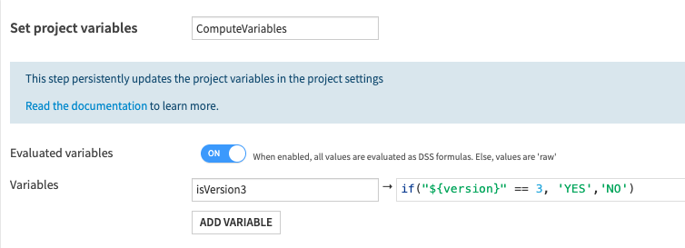

Variables in scenarios
#######################

When run, scenarios set up a supplementary level of variables, to define or redefine instance-wide or project-wide variables. These definitions and redefinitions of variables are then accessible to all actions during the scenario run, and to all reporters executed at the end of the run.

Variables scope
===============

There are 3 different levels of variables depending of the step of the scenario :

* Instance-level variables, accessible to administrators. Those variables can be set through the scenario step **Set global variables**.
* Project-level variables, for use anywhere in a given project. Those variables can be set through the scenario step **Set project variables**.
* Scenario-level variables, that don’t persist after a scenario ends. Those variables can be set through the scenario step **Define variables**.

Those step can evaluate a DSS formula and store the result as a variable. Subsequent steps and variable definitions will then be able to use the newly defined variable. The formulas in a **Define variables** step have access to all instance-wide and project-wide variables, and to the parameters of the trigger that initiated the scenario run.

It is also possible to update programmatically instance-level variables with the step **Run global variables update**, in which you can run Jython code, like the following snippet :

.. code-block:: Python

    def get_variables():
        return {"global_variable_1_key": "a_value", "global_variable_2_key": "another_value"}

Lastly, in all Python script scenario, variables are made available through a ``Scenario`` object, both for getting and setting.

See :ref:`update_variables_with_code` for more information.

Variables usage
===============

Once defined, your variables can be used inside your scenario steps through expansion. You can see various usages in the page :ref:`variables-expansion`.

Some scenario steps, such as **Set project variables**, can also use evaluated variables through the usage of formulas.
When this option is enabled, all values are evaluated as DSS formulas.

Please note also that any formula operation are available when computing evaluated variables. See :ref:`formula-language` for more information.

Usage in partition identifiers
==============================

When a step-based scenario is used, it is commonplace to have actions on given datasets, and if the dataset is partitioned, then specifying the partition targeted by the action is needed. This is done by setting a partition identifier in the corresponding parameter of the step. Variables are available in these fields, making it possible to use expressions to pick a specific partition.

For time partitioning, you can use special keywords. For example, "CURRENT_DAY" will be replaced by the current date when the scheduler runs the task. The complete list of time partitioning keywords is:

* CURRENT_HOUR
* CURRENT_DAY
* CURRENT_MONTH
* CURRENT_YEAR
* PREVIOUS_HOUR
* PREVIOUS_DAY
* PREVIOUS_MONTH
* PREVIOUS_YEAR

Examples
========

Using the current date to refresh a partition
---------------------------------------------

Selecting the partition corresponding to the current date can be done using the *CURRENT_DAY* and *CURRENT_MONTH* keywords as partition identifier. In the context of scenarios, a more flexible approach is to build the partition identifier with variables. For example, to build the partition identifier corresponding the previous month:

* add a *Define scenario variables* step
* add a first variable ``today`` whose expression is ``now()``
* add a second variable ``last_month`` whose expression is ``today.inc(-1, 'month')``
* finally, prepare the date as a partition identifier with a third variable ``last_month_id`` whose expression is ``last_month.substring(0,7)``

And in a ``Build`` step, the partition for a dataset can be set to ``${last_month_id}`` . A natural extension is to launch the building of several partitions at once, ie. doing dynamic partitioning. A list of partitions to build would then be a comma-separated list of partition identifiers. For more advanced usage of partitions, see :doc:`/partitions/identifiers`.

Using the date from a time-based trigger
----------------------------------------

Triggers produce parameters that can be used in expressions. To build a variable whose value is the date of the scenario launch minus 5 days:

* add a *Define scenario variables* step
* add a first variable ``start`` whose expression is ``asDate(scenarioTriggerParam_expectedStart)``
* add a second variable ``five_days_before_start`` whose expression is ``start.trunc('day').inc(-5, 'day')``

In case the scenario can be launched manually, the second variable should have as expression: ``if(isNull(start), now(), start).trunc('day').inc(-5, 'day')``

Using the results of a previous SQL step
----------------------------------------

Steps produce results, which can be used to define variables.

In order to access the step's result, the step must have a name, and can be accessed through the variable ``stepOutput_<step name>``.

For example, if the *Define scenario variables* comes after a step named *the_sql* of type *Execute SQL*, whose query is ``select max(order_date) as m from orders``, then building a variable from the maximum date of orders can be done:

* add a *Define scenario variables* step
* add a first variable ``max_orderdate`` whose expression is ``parseJson(stepOutput_the_sql)['rows'][0][0].asDate()``

Retrieving the message of a check
---------------------------------

The *Run checks* step keeps the results of the checks it has run for subsequent steps. A typical use is to insert checks results in reports sent at the end of the run.

For example, after a *Run checks* step named *the_checks*, the variable ``${stepOutput_the_checks}`` contains the JSON of the checks' output. If one is interested by the checks on a dataset named *checked* in the project *PROJ*, then the checks' results for that dataset is a variable ``parseJson(stepOutput_the_checks)['PROJ.checked'].results`` .

If the goal is to retrieve the status of a check *checkX*, with a bit of filtering one obtain this status with :

.. code-block:: shell
    
    ${filter(parseJson(stepOutput_the_checks)['PROJ.checked_NP'].results, x, x.check.meta.label == 'checkX')[0].value.outcome}

Retrieving the value of a metric
---------------------------------

The *Compute metrics* step keeps the results of the metrics it has run for subsequent steps.

For example, after a *Compute metrics* step named *the_metrics*, the variable ``${stepOutput_the_metrics}`` contains the JSON of the metrics' computation output, indicating which metrics got computed and their value, and which metrics were skipped. If one is interested by the value of the metrics on a dataset named *computed* in the project *PROJ*, then the metrics' results for that dataset is a variable ``parseJson(stepOutput_the_metrics)['PROJ.computed'].results`` .

If the goal is to retrieve the value of the metric *col_stats:MIN:cost*, with a bit of filtering one obtains this status with :

.. code-block:: shell

    ${filter(parseJson(stepOutput_the_metrics)['PROJ.computed_NP'].computed, x, x.metricId == 'col_stats:MIN:cost')[0].value}

Similarly, if you wish to retrieve the row count metric *records:COUNT_RECORDS*, you can do it with the following command :

.. code-block:: shell

    ${filter(parseJson(stepOutput_the_metrics)['PROJ.computed_NP'].computed, x, x.metricId == 'records:COUNT_RECORDS')[0].value}

.. note::
   Whenever you try to get a metric or check value from a dataset, you will need to append ``_`` and the partition name of your dataset to the end of its name, or ``_NP`` for a non-partitioned dataset.

   In all the examples above, we assumed that the dataset *computed* is not partitioned. However, if it is partitioned and we wanted to fetch the value of the metric *records:COUNT_RECORDS* for the partition *FOO*, then the code should be :

   .. code-block:: shell

        ${filter(parseJson(stepOutput_the_metrics)['PROJ.computed_FOO'].computed, x, x.metricId == 'records:COUNT_RECORDS')[0].value}
