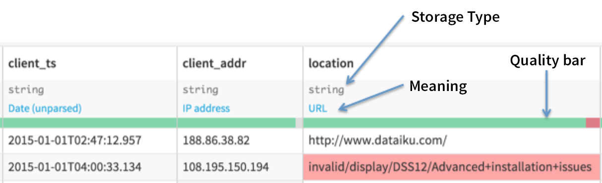
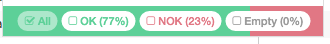
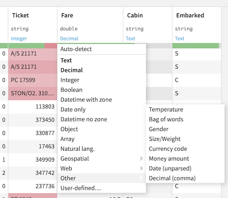
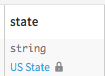

Basic usage
############

When you open a dataset in the "Explore" view, for each column, both the storage type (stored in the dataset metadata) and the meaning (inferred from data) are displayed.

In this example, we can see that the "location" column is stored as the basic "string" storage type, but DSS has inferred that the content is actually an URL, since most rows are *valid* for the "URL meaning".

By default, the explore views shows a *data quality bar*, which shows which rows are valid for their *meaning*.
When you are in data exploration, meanings are mostly useful for informational purpose.

If you choose to *Filter* a column (click on Column header then on "Filter"), the filter shows a quality bar with checkboxes that allow you to focus on rows that are valid, invalid or empty for their meanings.

Changing meaning and storage type
====================================

In dataset explore, you can change the storage type and the meaning by clicking on them.

   
Changing the storage type
--------------------------

Modifying the storage type for a column from the dataset explore screen has the exact same effect as doing it from the dataset settings.

You should generally be very careful when changing the storage type since it is used in external systems. See :doc:`definitions` for more info about how the storage type is used.

Changing the meaning
----------------------

When you change the meaning, what you actually do is store in the dataset metadata that for this column, the meaning should not be auto-detected, but instead forced to the one you specified. When a column has a forced meaning, a small lock appears next to it.

Forcing the meaning is mostly useful when the automatic inference got it wrong.

You can go back to selecting "Auto-detect", either in the meanings dropdown, or in the dataset schema screen.

Editing advanced schema
------------------------

You can also click on the column header > Edit column data (or go in the dataset settings screen) to set:

* the details of the storage type (string max length, complex type elements, ...)
* a description for the column.

The column description is displayed wherever it may be relevant.
