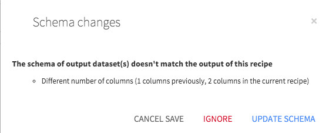

Handling of schemas by recipes
###############################

Most recipes in DSS are able to generate automatically the output schema of their datasets, either:

* When you click on the Save button
* When you click on the Validate button

.. contents::
	:local:

.. note::

	DSS never automatically changes the schema of a dataset while running a job. Changing the schema of a dataset is a dangerous operation, which can lead to previous data becoming unreadable, especially for partitioned datasets.

.. note::

	When possible, the schema verification is also performed when you "Run" the recipe from the recipe editor screen. It is however never performed when you build a dataset from :

		* The dataset actions menu
		* The Flow
		* A scheduled job
		* The API

	If you want to perform schema verifications from outside of the recipe editor screen, you need to use the :doc:`Propagate Schema Flow tool </flow/building-datasets>`.

Sample, Filter, Group, Window, Join, Split, Stack
===================================================

For these recipes, the output schema is automatically computed each time you Save the recipe. If the computed schema does not match the current output dataset schema, a warning popup appears.

You can either accept the change, which outputs the schema in the output dataset, or ignore it.

.. note::

	Ignoring output schema changes will often lead to recipe failures. For example, a Grouping recipe running in-database performs an INSERT in the target table. This INSERT fails if the schema of the output dataset is not correct.

Sync
======

The Sync recipe has two modes of operation when it comes to schema handling:

* Strict schema equality (default). In this mode, the Sync recipe behaves like the previous ones (schema updated when saving or running from the recipe editor).
* Free output schema (name-based matching). In this mode, the Sync recipe never updates the output schema. You can use this Sync recipe mode if you want to only keep a few columns from the input dataset.

.. note::
	| Matching is case sensitive in "Free output schema (name-based matching)" mode. 
	| For example, a column named ``c1`` in the input dataset will not match to a column named ``C1`` in the output dataset.

Prepare
========

The Prepare recipe has a specific behavior. See :doc:`data-preparation`.

Hive, Impala, SQL
=======================

For these recipes, computing the output schema requires calls to external systems. For example, for SQL, DSS sends the query to the database, and checks the schema of the resulting set.

Since these calls are expensive, they are not performed when you click on Save. Instead, a dedicated "Validate" button must be used.

Python, R, PySpark, SparkR
===========================

For these 4 recipes, there is no way for DSS to automatically compute the schema of the output dataset. However, the Dataiku APIs that you use to interact with datasets provide ways to set the schema *when the recipe is executed*

These recipes thus update their schema at runtime (but only when you explicitly ask for it by using the appropriate API). This is particularly useful since you can easily set the schema of a dataset from the dataframe object of these languages.

However, you need to be quite careful when updating schemas from code, especially with partitioned datasets, since schema changes may render data of other partitions unreadable.

Machine Learning (scoring)
============================

These recipes behave like Prepare.

SparkSQL
=========

The SparkSQL recipe is unique: it unconditionally updates the schema at runtime. This breaks the rule stated at the beginning of this paragraph. Note that this situation might change in a future release.

Shell
======

The Shell recipe normally doesn't touch the output dataset schema. However, if you use the "Pipe out" option with "Auto-infer output schema", the schema is unconditionally updated at runtime.
