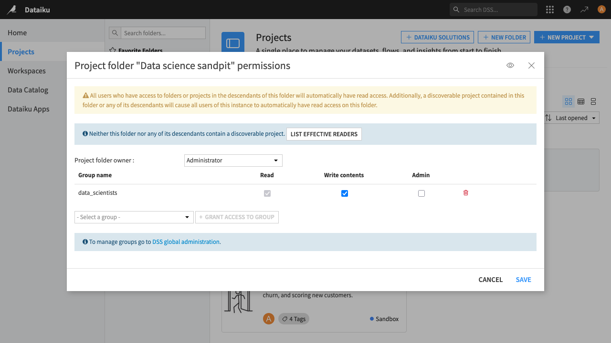
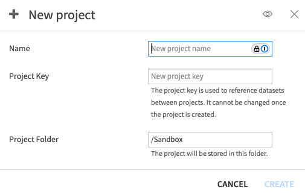
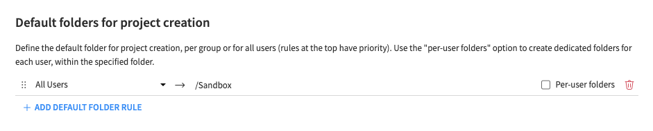
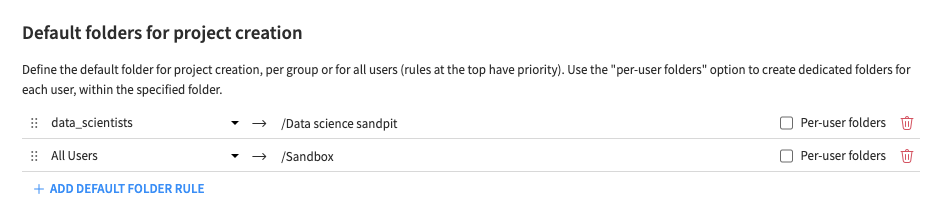
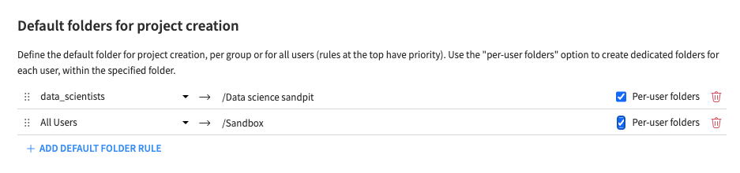

Project folders - defaults and access
#####################################

.. contents::
	:local:

Project Folders are used to organize projects, and are shown in the :doc:`projects page </concepts/homepage/projects-page>`.

Project folder access and permissions
=====================================

There are three levels of permission for each folder - `Read`, `Write Contents` and `Admin`. For each folder, you can assign these permissions to specific groups or to `All Users` - click on the ellipsis in the corner of the folder and select **Permissions**. There is also a folder owner (the user who created the folder unless changed), who has Admin-level permissions.

Giving `Read` access to the folder will alway make it appear in the folder hierarchy. The opposite is not true, a folder can still be visible without the user having any permission on that project, for example, if it has contents that are visible to the user (see the `Project Folder visibility rules` section below)

Project folder visibility rules
================================

A user can see a folder in the hierarchy if any of following conditions are met:

- The user has at least read permissions on the folder itself
- The user has at least read permissions on any descendant folder in the hierarchy
- There is a project in the folder, or one of its descendants, which is visible to the user (this can be because of project permissions or because the project is discoverable - see :doc:`project access settings </security/project-access>`)

Folder creation configuration
==============================

There are some configuration options you can use to aid users create projects quickly in Dataiku while preventing things from becoming untidy.

The first simple thing is to limit the write access to the root folder - if all users can create projects in the root area, they will be visible from the home page of other users, and things may become disorganised. To prevent this, see: :doc:`Permissions: "Write in root project folder" </security/permissions>`

Then there is the default folder configuration. This comes into play when users create or import a project, and they get a choice of the location in the folder hierarchy for the new project. When in the context of a specific folder for which the user has `Write Contents` permission, the location suggested by DSS is just that folder itself. But when it's done in a central location, such as on the home page, or somewhere the user cannot write, DSS suggests a default folder. 

The default behaviour is to suggest the "Sandbox" folder for `all` users - this is a top level folder that is writable for all users. The idea of this is to give users an area where they can freely create projects and experiment. (Note: only users who have permissions and a profile which allows them to create some form of project will be able to do this - the permissions in :doc: `Project Permissions </security/permissions>` still apply ).

To change this configuration go to the  **Administration > Settings > Themes & Customization** page, to the section **Default folders for project creation** which contains the rules:

Here you can change the default folder for `All Users`, or add different rules for specific groups, so users from these groups are directed towards sensible default locations for their projects. (Take care to ensure the groups you choose have `Write Contents` access to the locations you specify for them). For example:

Per-user folders 
----------------

If you are concerned that all your users are sharing the same sandbox area and this might create confusion, you can turn on the `Per-user folders` setting for the rule(s). This means when a user goes to create a project, DSS will create and suggest a folder with a name derived from the user's login (under the folder specified in the rule). This way users will automatically get their own area for experimentation. (Note: whether the users will be able to see each other users' folders will depend on the discoverability of the projects inside them - if there are any that are discoverable, they will - see :doc:`project access settings </security/project-access>`).

