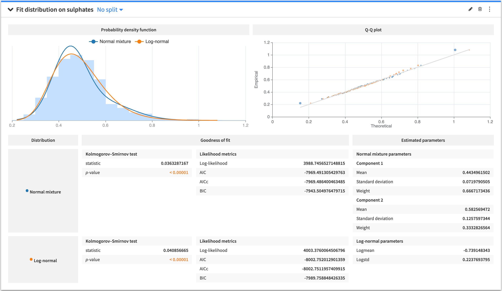
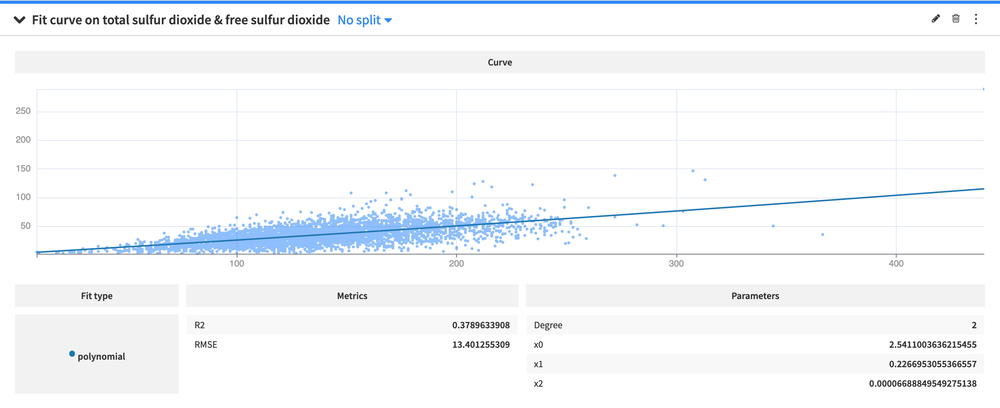

.. _statistics-fit:

Fit curves and distributions
##############################

The **Fit curves & distributions** cards model the distributions or relationships of numerical variables. To create a card, you must select from the following options:

* :ref:`fit-distribution`
* :ref:`2Dfit-distribution`
* :ref:`fit-curve`

.. _fit-distribution:

Fit Distribution
===============================

The **Fit Distribution** card estimates the parameters of probability distributions for a specified variable in your dataset. The supported distributions are:

* Beta
* Exponential
* Laplace
* Log-normal
* Normal
* Normal mixture
* Pareto
* Triangular
* Weibull

You can select multiple distributions in the card, and Dataiku DSS displays the probability density function, `Q-Q plot <https://en.wikipedia.org/wiki/Q-Q_plot>`_, goodness of fit metrics, and estimated parameters for each distribution.

.. _2Dfit-distribution:

2D Fit Distribution
===============================
.. image:: img/fit-2d.png

The **2D Fit Distribution** card visualizes the density of bivariate distributions by plotting the `kernel density estimate (KDE) <https://en.wikipedia.org/wiki/Multivariate_kernel_density_estimation>`_ or the joint normal (Gaussian) distribution. To create the card:

* Specify values for the X and Y variables
* Select either "2D KDE" plot or the "Joint Normal" plot
* If you select the "2D KDE" plot, DSS provides two additional parameters: "X relative bandwidth" and "Y relative bandwidth" (in percentages) with default values. However, you can modify these values to control the smoothness of the KDE plot. Larger values produce smoother plots.

  Note that the "X relative bandwidth" value scales the horizontal KDE bandwidth as a percentage of the standard deviation of variable X. Likewise, the "Y relative bandwidth" scales the vertical KDE bandwidth as a percentage of the standard deviation of variable Y.

.. _fit-curve:

Fit curve
===============================

The **Fit Curve** card models the relationship between two variables by creating one or more fit curves. To create the card:

* Specify values for the X and Y variables
* Specify the "Curve Type" as **Polynomial** or **Isotonic**
* If you select a **Polynomial** curve, then you must provide an integer value for an additional parameter, "Degree", which specifies the degree of the polynomial.
