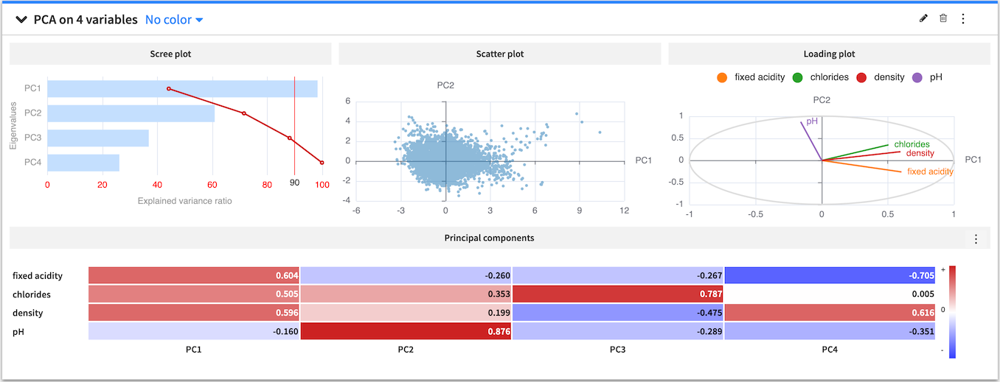
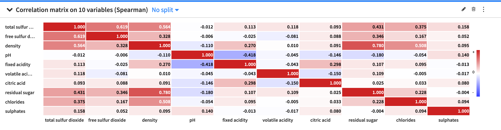
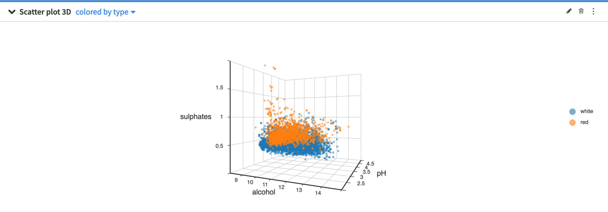
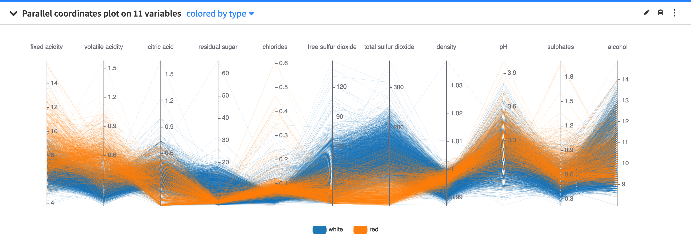

.. _statistics-multivariate:

Multivariate Analysis
#####################

The **Multivariate analysis** cards provide tools to model the distribution of numerical variables across multiple dimensions. To create a card, you must select from the following options:

* :ref:`pca`
* :ref:`correlation-matrix`
* :ref:`scatter-3d`
* :ref:`pcp`

.. _pca:

Principal Component Analysis (PCA)
==================================

Principal component analysis is a popular tool for performing dimensionality reduction in a dataset. PCA performs a linear transformation of a dataset (having possibly correlated variables) to a dimension of linearly uncorrelated variables (called principal components). This transformation aims to maximize the variance of the data. In practice, you would select a subset of the principal components to represent your dataset in a reduced dimension.

The **Principal Component Analysis** card provides a visual representation of a dataset in a reduced dimension.

The PCA card displays a scree plot of eigenvalues for each principal component and the cumulative explained variance (in percentage). The card also displays a scatter plot of the data projected onto the first two principal components and a heatmap that shows the composition of all the principal components.

You can use the PCA configuration menu (✎) to configure the visualization of the heatmap by toggling the values and colors on and off or choosing to show absolute values.

You can also use the PCA general menu (⋮) to export the PCA card as a recipe in the flow. The created recipe must have at least one of the following output datasets:

* the **projections** dataset contains the projection of the input variables on the principal components
* the **eigenvectors** dataset contains the principal components
* the **eigenvalues** dataset contains the amount of variance in the input variables which is explained by each principal component

When creating a PCA recipe from a worksheet card, its settings are copied from the worksheet and the card, such as the sampling or the container configuration for instance. All the recipe settings are independent from the worksheet settings and can be subsequently modified from the recipe settings page.

.. _correlation-matrix:

Correlation matrix
==================

A correlation matrix is useful for showing the correlation coefficients (or degree of relationship) between variables. The correlation matrix is symmetric, as the correlation between a variable V\ :sub:`1` and variable V\ :sub:`2` is the same as the correlation between V\ :sub:`2` and variable V\ :sub:`1`. Also, the values on the diagonal are always equal to one, because a variable is always perfectly correlated with itself.

The **Correlation matrix** card allows you to view a visual table of the pairwise correlations for multiple variables in your dataset. By default, Dataiku DSS computes the `Spearman's rank <https://en.wikipedia.org/wiki/Spearman%27s_rank_correlation_coefficient>`_ correlation coefficient, but you can select to compute the `Pearson <https://en.wikipedia.org/wiki/Pearson_correlation_coefficient>`_ correlation coefficient instead. Note that you can only use numerical variables to compute the correlation matrix.

The default setting of the correlation matrix displays signed (positive and negative) correlation values within colored cells, with the colors corresponding to the values. However, you can use the correlation matrix configuration menu (✎) to configure the visualization of the correlation matrix. The menu provides options to:

* Toggle the values and colors on and off
* Convert correlation values to absolute values
* Set a threshold so that the matrix only displays a correlation value if its magnitude (or absolute value) is greater than the threshold value.

.. _scatter-3d:

Scatter plot 3D
===============

The scatter plot 3D uses Cartesian coordinates to display the values of three numerical variables in a dataset.

By clicking the scatter plot 3D configuration menu (✎) you can configure:

* the size of the points in the plot
* the maximum number of points to display

The points to display are randomly drawn from the sample of the worksheet. See :ref:`worksheet elements<worksheet_elements>` for more information about sampling.

.. _pcp:

Parallel Coordinates Plot
=========================

The parallel coordinates plot provides a graphical way to visualize a dataset across a high number of dimensions. The backdrop is made of several parallel axes, each representing a column in the dataset. Each point in the dataset corresponds to a multiline which joins all of the parallel axes at the values taken by the data point.

You can use the parallel coordinates plot configuration menu (✎) to configure the maximum number of data points to display.

The points to display are randomly drawn from the sample of the worksheet. See :ref:`worksheet elements<worksheet_elements>` for more information about sampling.
