Statistical Tests
####################

The **Statistical tests** cards allow you to make quantitative decisions by testing statistical hypotheses. Each card displays the outcome of a specific statistical test, and you can see more information about the test (e.g. what the test does, underlying assumptions, etc) by clicking the question icon |question-mark-icon| in the card header.

You can also use the card general menu (⋮) to export a statistical test card as a recipe in the flow. When creating a statistical test recipe from a worksheet card, its settings are copied from the worksheet and the card, such as the sampling or the container configuration for instance. All the recipe settings are independent from the worksheet settings and can be subsequently modified from the recipe settings page.

The statistical tests cards are grouped into:

* :ref:`one-sample-tests`

 * :ref:`one-sample-ttest`
 * :ref:`one-sample-sign-test`
 * :ref:`shapiro-wilk-test`

* :ref:`two-sample-tests`

 * :ref:`two-sample-ttest`
 * :ref:`median-mood-test`
 * :ref:`two-sample-levene-test`
 * :ref:`kolmog-smirnov-test`

* :ref:`n-sample-tests`

 * :ref:`one-way-anova-test`
 * :ref:`n-median-mood-test`
 * :ref:`n-sample-levene-test`
 * :ref:`pairwise-student-ttest`
 * :ref:`pairwise-median-mood-test`
 * :ref:`pairwise-levene-test`

* :ref:`categorical-test`

 * :ref:`chi-square-indep-test`

.. _one-sample-tests:

One-sample tests
-----------------

These types of tests allow you to compare the location parameters of a population to a hypothesized constant, or to compare the distribution of a population to a hypothesized one.

.. _one-sample-ttest:

Student *t*-test / Z-test (one-sample)
======================================

A one-sample test to determine if the mean of a variable in a population is a specific value.

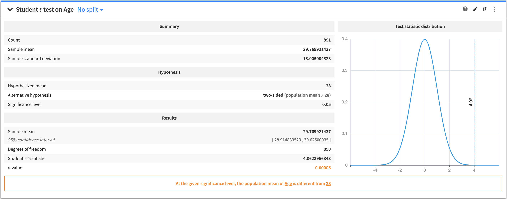

To create this card, select a numerical (continuous) variable as the test variable, specify a value for the hypothesized mean, and select the alternative hypothesis to perform a two-sided or one-sided test.

.. note::
    It is also possible to set the standard deviation of the tested population when it is known prior to the test.
    In this case a **Z-test** will be performed, rather than a Student t-test.

The tested hypothesis is that the mean of the test variable in the tested population is equal to the hypothesized mean.

The output of the one-sample **Student t-test / Z-test** contains:

* A summary of the test variable
* The tested and alternative hypotheses
* The results of the test
* A figure that displays the distribution of the test statistic.
* A conclusion about the test (whether the tested hypothesis is rejected, or if the test is inconclusive)

.. _one-sample-sign-test:

Sign test (one-sample)
===============================

A one-sample test to determine if the median of a variable in a population is a specified value.

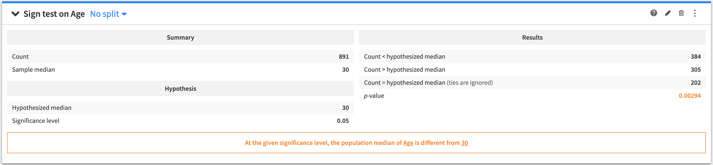

To create this card, select a numerical (continuous) variable as the test variable, and specify a value for the hypothesized median.

The tested hypothesis is that the median of the test variable in the tested population is equal to the hypothesized median.

The output of the one-sample **Sign test** contains:

* A summary of the test variable
* The tested hypothesis
* The results of the test
* A conclusion about the test (whether the tested hypothesis is rejected, or if the test is inconclusive)

.. _shapiro-wilk-test:

Shapiro-Wilk test
===============================

A one-sample test to determine if a variable is normally distributed in a population.

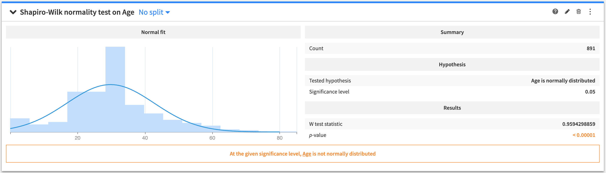

To create this card, select a numerical (continuous) variable as the test variable.

The tested hypothesis is that the sample comes from a normal (Gaussian) distribution.

The output of the  **Shapiro-Wilk test** contains:

* A figure of a normal distribution fit to the data
* The summary of the data
* The tested hypothesis
* The results of the test
* A conclusion about the test (whether the tested hypothesis is rejected, or if the test is inconclusive).

.. _two-sample-tests:

Two-sample tests
-----------------

These types of tests allow you to compare the location parameters of two populations, or to compare the distributions of two populations.

.. _two-sample-ttest:

Student/Welch *t*-test (two-sample)
===================================

A two-sample test to determine if the mean of a variable is the same between two populations.

.. image:: img/2-sample-t.png

To create this card:

* Select a numerical (continuous) variable as the "Test variable"
* Select whether to assume that the variance is equal between the two populations
* Select a categorical variable to define the populations by its values
* Add values from the categorical variable to create two different populations "Population 1" and "Population 2"
* Select the alternative hypothesis to perform a two-sided or one-sided test

The tested hypothesis is that the mean of the test variable is identical in the two populations.

The output of the two-sample **Student/Welch t-test** contains:

* A summary of the population samples
* The tested and alternative hypotheses
* The results of the test
* A conclusion about the test (whether the tested hypothesis is rejected, or if the test is inconclusive).

.. _median-mood-test:

Median Mood test (two-sample)
===============================

A two-sample test to determine if the median of a variable is the same between two populations.

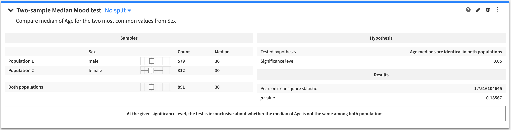

To create this card:

* Select a numerical (continuous) variable as the "Test variable"
* Select a categorical variable to define the populations by its values
* Add values from the categorical variable to create two different populations "Population 1" and "Population 2"

The tested hypothesis is that the median of the test variable is identical in the two populations.

The output of the two-sample **Median Mood test** contains:

* A summary of the population samples
* The tested hypothesis
* The results of the test
* A conclusion about the test (whether the tested hypothesis is rejected, or if the test is inconclusive).

.. _two-sample-levene-test:

Levene test (two-sample)
===============================

A two-sample test to determine if the variance of a variable is the same between two populations.

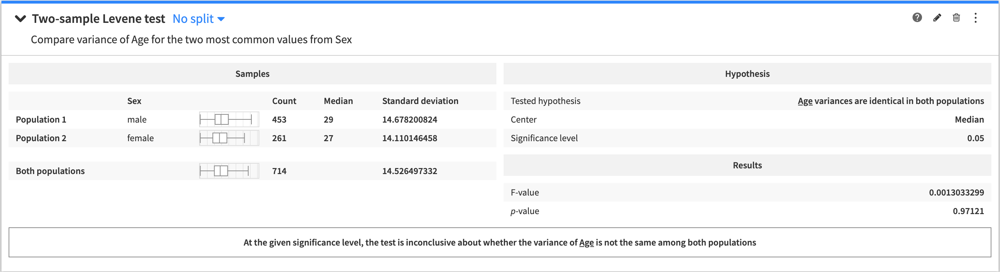

To create this card:

* Select a numerical (continuous) variable as the "Test variable"
* Select the statistics used for centering observations within each population
* Select a categorical variable to define the populations by its values
* Add values from the categorical variable to create two different populations "Population 1" and "Population 2"

The tested hypothesis is that the variance of the test variable is identical in the two populations.

The output of the two-sample **Levene test** contains:

* A summary of the population samples
* The tested hypothesis
* The results of the test
* A conclusion about the test (whether the tested hypothesis is rejected, or if the test is inconclusive).

.. _kolmog-smirnov-test:

Kolmogorov-Smirnov test (two-sample)
=====================================

A two-sample test to determine if a variable is similarly distributed between two populations.

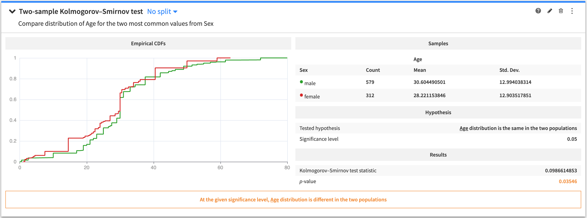

To create this card:

* Select a numerical variable as the "Test variable"
* Select a categorical variable to define the populations by its values
* Add values from the categorical variable to create two different populations "Population 1" and "Population 2"

The tested hypothesis is that the probability distribution is the same in the two populations.

The output of the two-sample **Kolmogorov-Smirnov test** contains:

* A figure showing the empirical Cumulative Distribution Functions (CDFs) of the two populations
* A summary of the population samples
* The tested hypothesis
* The results of the test
* A conclusion about the test (whether the tested hypothesis is rejected, or if the test is inconclusive).

.. _n-sample-tests:

N-sample tests
-----------------

These types of tests allow you to compare the location parameters of multiple populations.

.. _one-way-anova-test:

One-way ANOVA
===============================

An n-sample test to determine if the mean of a variable is the same in multiple populations.

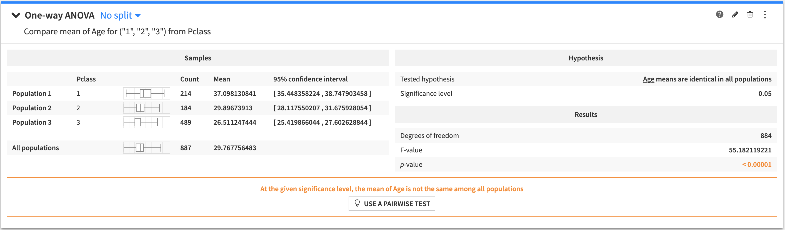

To create this card:

* Select a numerical variable as the "Test variable"
* Select a categorical variable to define the populations by its values
* Select either:

 * "Build the populations from the most frequent values" of your categorical variable and then specify a value for the "Maximum number of populations", or
 * "Define the populations manually" and then enter the values of your categorical variable to form the populations.

The tested hypothesis is that the mean of the test variable is identical in all populations.

The output of the **One-way ANOVA test** contains:

* A summary of the population samples in all the groups
* The tested hypothesis
* The results of the test
* A conclusion about the test (whether the tested hypothesis is rejected, or if the test is inconclusive).

.. _n-median-mood-test:

Median Mood test (N-sample)
===============================

An n-sample test to determine if the median of a variable is the same in multiple populations.

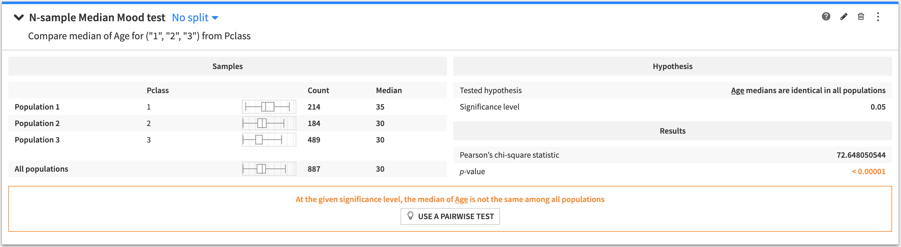

To create this card:

* Select a numerical variable as the "Test variable"
* Select a categorical variable to define the populations by its values
* Select either:

 * "Build the populations from the most frequent values" of your categorical variable and then specify a value for the "Maximum number of populations", or
 * "Define the populations manually" and then enter the values of your categorical variable to form the populations.

The tested hypothesis is that the median of the test variable is identical in all populations.

The output of the **N-sample Median Mood test** contains:

* A summary of the population samples in all the groups
* The tested hypothesis
* The results of the test
* A conclusion about the test (whether the tested hypothesis is rejected, or if the test is inconclusive).

.. _n-sample-levene-test:

Levene test (N-sample)
===============================

An n-sample test to determine if the variance of a variable is the same in multiple populations.

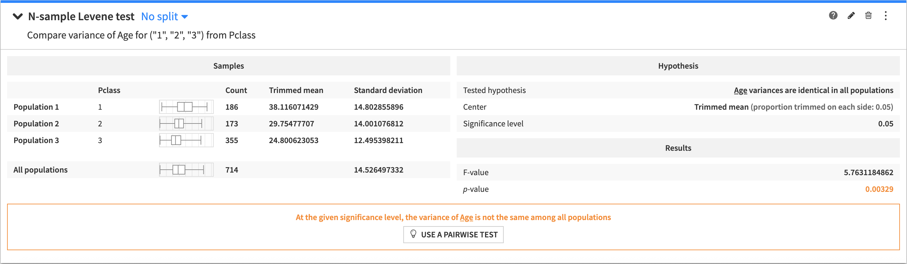

To create this card:

* Select a numerical variable as the "Test variable"
* Select the statistics used for centering observations within each population
* Select a categorical variable to define the populations by its values
* Select either:

 * "Build the populations from the most frequent values" of your categorical variable and then specify a value for the "Maximum number of populations", or
 * "Define the populations manually" and then enter the values of your categorical variable to form the populations.

The tested hypothesis is that the variance of the test variable is identical in all populations.

The output of the **N-sample Levene test** contains:

* A summary of the population samples in all the groups
* The tested hypothesis
* The results of the test
* A conclusion about the test (whether the tested hypothesis is rejected, or if the test is inconclusive).

.. _pairwise-student-ttest:

Pairwise Student/Welch *t*-test
===============================

An n-sample test to determine if the mean of a variable is the same within pairs of populations.

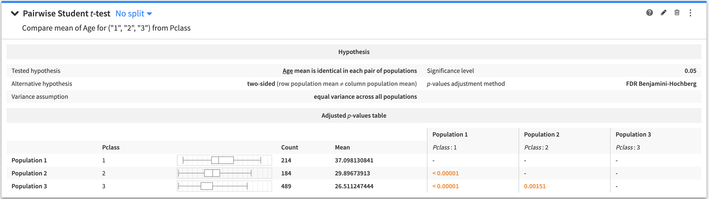

To create this card:

* Select a numerical variable as the "Test variable"
* Select whether to assume that the variance is equal across all the tested populations
* Select a categorical variable to define the populations by its values
* Select either:

 * "Build the populations from the most frequent values" of your categorical variable and then specify a value for the "Maximum number of populations", or
 * "Define the populations manually" and then enter the values of your categorical variable to form the populations.

* Select either:

 * "Compare all pairs" to test all the pairs that can be formed from the selected populations, or
 * "Compare against reference population" and enter the value of the categorical variable corresponding to a single reference population.

* Select the alternative hypothesis to perform a two-sided or one-sided test for each pair
* Select a value for the "Adjustment Method" from the options: **None**, **Bonferroni**, **Holm-Bonferroni** or **FDR Benjamini-Hochberg**

The tested hypothesis is that the mean of the test variable is identical in the two populations within each pair of populations.

The output of the **Pairwise t-test** contains:

* The tested and alternative hypotheses
* A table of pairwise *p*-values. Holding the cursor over any given *p*-value tells you whether the tested hypothesis is rejected, or if the test is inconclusive.

.. _pairwise-median-mood-test:

Pairwise median Mood test
===============================

An n-sample test to determine if the median of a variable is the same within pairs of populations.

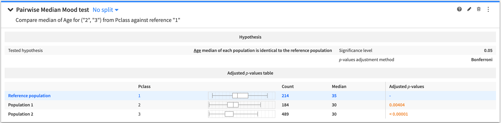

To create this card:

* Select a numerical variable as the "Test variable"
* Select a categorical variable to define the populations by its values
* Select either:

 * "Build the populations from the most frequent values" of your categorical variable and then specify a value for the "Maximum number of populations", or
 * "Define the populations manually" and then enter the values of your categorical variable to form the populations.

* Select either:

 * "Compare all pairs" to test all the pairs that can be formed from the selected populations, or
 * "Compare against reference population" and enter the value of the categorical variable corresponding to a single reference population.

* Select a value for the "Adjustment Method" from the options: **None**, **Bonferroni**, **Holm-Bonferroni** or **FDR Benjamini-Hochberg**

The tested hypothesis is that the median of the test variable is identical in the two populations within each pair of populations.

The output of the **Pairwise median Mood test** contains:

* The tested hypothesis
* A table of pairwise *p*-values. Holding the cursor over any given *p*-value tells you whether the tested hypothesis is rejected, or if the test is inconclusive.

.. _pairwise-levene-test:

Pairwise Levene test
===============================

An n-sample test to determine if the variance of a variable is the same within pairs of populations.

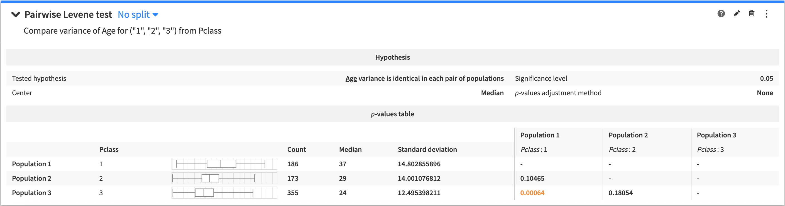

To create this card:

* Select a numerical variable as the "Test variable"
* Select the statistics used for centering observations within each population
* Select a categorical variable to define the populations by its values
* Select either:

 * "Build the populations from the most frequent values" of your categorical variable and then specify a value for the "Maximum number of populations", or
 * "Define the populations manually" and then enter the values of your categorical variable to form the populations.

* Select either:

 * "Compare all pairs" to test all the pairs that can be formed from the selected populations, or
 * "Compare against reference population" and enter the value of the categorical variable corresponding to a single reference population.

* Select a value for the "Adjustment Method" from the options: **None**, **Bonferroni**, **Holm-Bonferroni** or **FDR Benjamini-Hochberg**

The tested hypothesis is that the variance of the test variable is identical in the two populations within each pair of populations.

The output of the **Pairwise Levene test** contains:

* The tested hypothesis
* A table of pairwise *p*-values. Holding the cursor over any given *p*-value tells you whether the tested hypothesis is rejected, or if the test is inconclusive.

.. _categorical-test:

Categorical test
-------------------

This type of test determines whether there is a significant relationship between two categorical variables in a sample or if the two variables are independent.

.. _chi-square-indep-test:

Chi-square independence test
===============================

A test to determine if two categorical variables are independent.

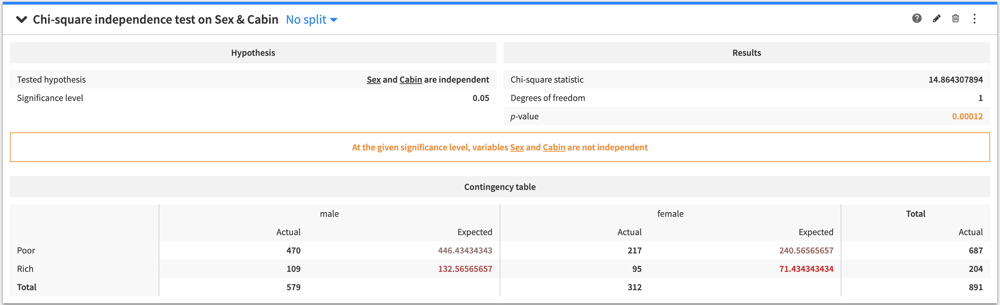

To create this card:

* Select categorical variables for "Variable 1" and "Variable 2"
* Specify numerical values for the "Maximum X Values to Display" and the "Maximum Y Values to Display"

The tested hypothesis is that the two variables are independent.

The output of the **Chi-square independence test** contains:

* The tested hypothesis
* The results of the test
* A conclusion about the test (whether the tested hypothesis is rejected, or if the test is inconclusive)
* A table of the actual versus expected number of observations for each row and column combination in the table count of values for each cell
