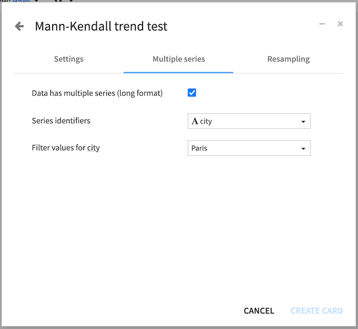
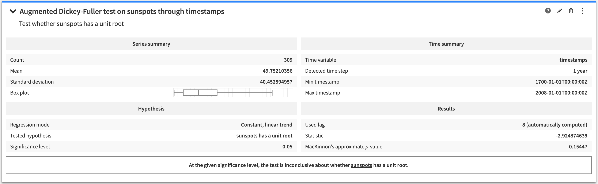
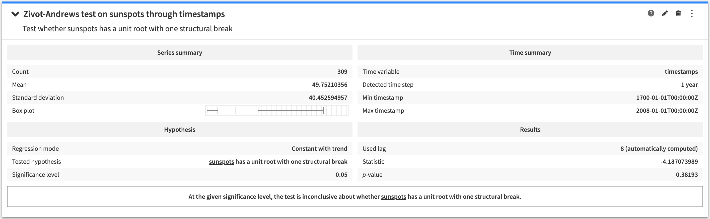
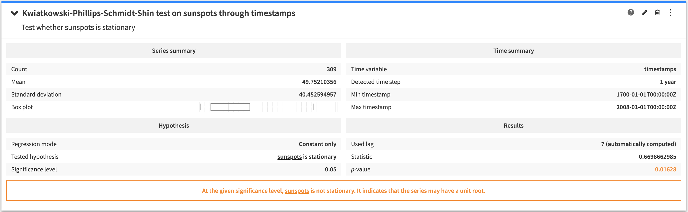
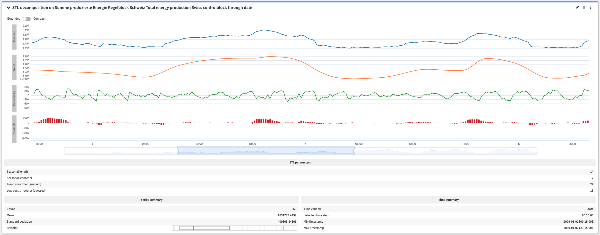
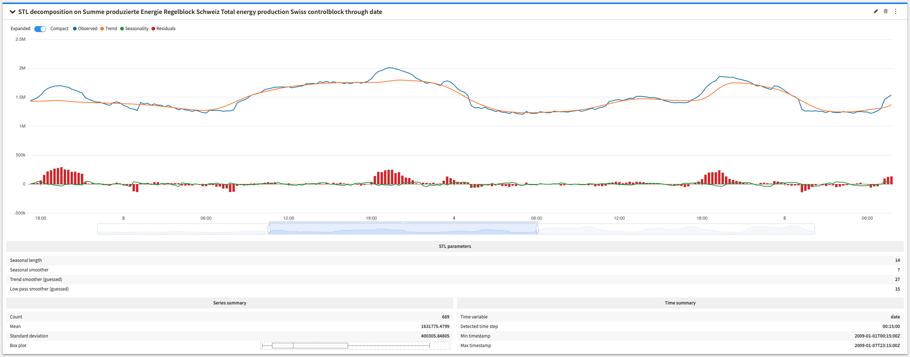
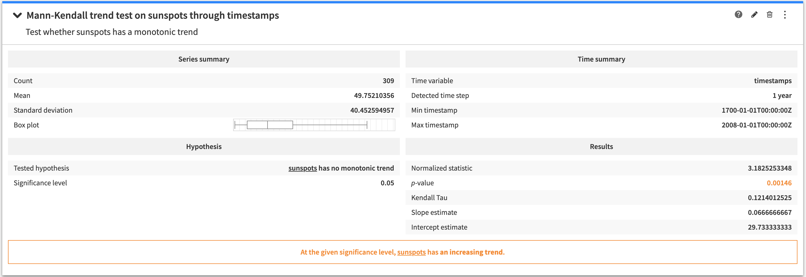
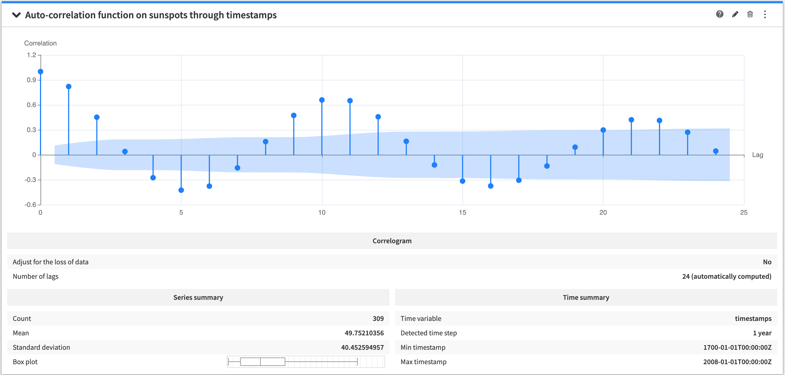
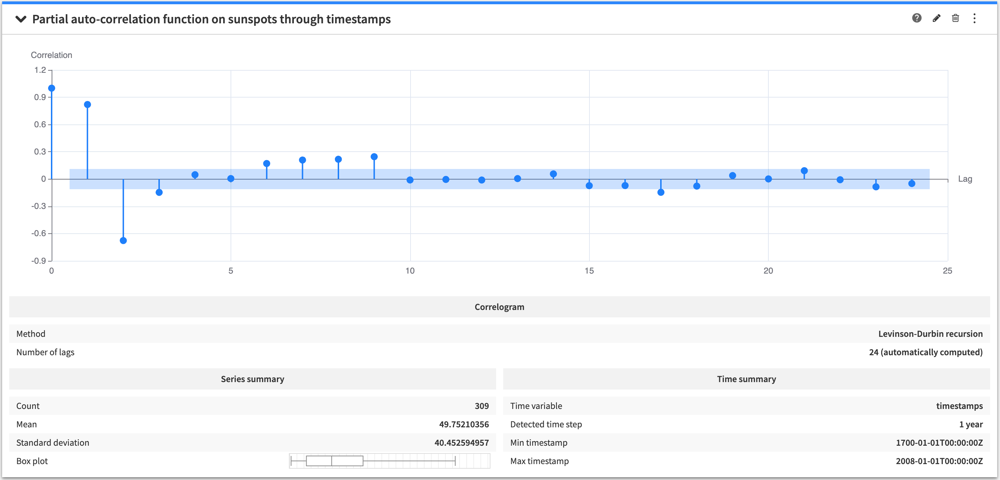
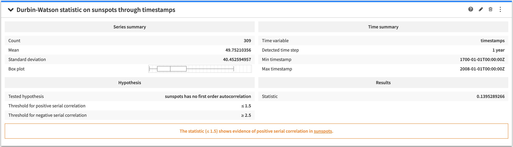

.. _statistics-time-series:

Time Series Analysis
####################

Time series analysis is useful for exploring a dataset which contains one or
more time series. This kind of analysis allows you to perform statistical tests
on time series, as well as to inspect some of its properties like the
auto-correlation function.

All of these cards share common configuration options. In order to create or
configure a time series analysis, you have to select a numerical (continuous)
variable which holds the series values. You also have to select a time variable
which holds the timestamps formatted according to the ISO8601 format.

If the dataset uses the :ref:`long format <ts_long_format_label>` to store the
time series, it is possible to specify the time series identifiers by checking
the corresponding checkbox. In this case, the variable name as well as the
value used to discriminate the time series must be provided.

All time series card outputs include a summary for the time series, as well as
the detected time step for the series.

.. warning::
    Most of the time series computations require that the time series is evenly
    distributed with a constant time step. Resampling of a time series using a
    constant time step can be achieved by using the
    :doc:`time series preparation </time-series/time-series-preparation/resampling>`
    plugin

.. |question-mark-icon| image:: img/question_icon.png

The analysis cards are grouped into:

* :ref:`unit-root-tests`

  * :ref:`adf-test`
  * :ref:`za-test`
  * :ref:`kpss-test`

* :ref:`trend-tests`

  * :ref:`mk-test`

* :ref:`auto-correlation-function`

  * :ref:`acf-plot`
  * :ref:`pacf-plot`
  * :ref:`dw-stat`

.. _unit-root-tests:

Stationarity and unit root tests
--------------------------------

This kind of test allow you to assess whether a time series is stationary or
has a unit root. A stationary series is a series which statistical properties
do not change over time. Also, the presence of a unit root in a time series
suggests that the series is not stationary.

By default, the number of lags that will be used by the test is automatically
computed but you can choose to manually set this value if it suits your use
case better.

The conclusion of a unit root test indicates whether the test rejects the
hypothesis at the given significance level, or whether it is inconclusive.

.. _adf-test:

Augmented Dickey-Fuller (ADF) test
==================================

The Augmented Dickey-Fuller test tests the hypothesis that there exists a unit
root in the time series.

The configuration options allow to specify the regression model that is used by
the test.

.. _za-test:

Zivot-Andrews test
==================

The Zivot-Andrews test tests the hypothesis that there exists a unit root with
one structural break in the time series.

The configuration options allow to specify the regression model that is used by
the test.

.. _kpss-test:

Kwiatkowski-Phillips-Schmidt-Shin (KPSS) test
=============================================

The KPSS test tests the hypothesis that the time series is stationary.

The configuration options allow to specify the regression model that is used by
the test.

.. _trend-tests:

Trend
-----

This kind of analysis allows to inspect the trend of a time series.

.. _stl-decomposition-plot:

STL decomposition plot
=======================

The STL decomposition plot is used to visualize the trend and seasonality of a series.

You can also enable the compact view to display the original series and its components 
(trend, seasonality and residuals) on a uniform scale. This not only makes comparing 
series with similar scales easier (usually the original series and the trend series), 
but also helps identifying differences in scale among the series.

The configuration options give control over the type of decomposition that you want (additive or multiplicative) and over the STL decomposition algorithm parameters.

.. note::
    The parameters of the STL decomposition algorithm are the ones from the statsmodels library. For more information visit `the statsmodels documentation <https://www.statsmodels.org/v0.12.2/generated/statsmodels.tsa.seasonal.STL.html>`_.

.. _mk-test:

Mann-Kendall trend test
=======================

The Mann-Kendall trend Test is used to analyze series data for consistently
increasing or decreasing trends (monotonic trends). It tests the hypothesis
that there is no monotonic trend in the time series.

The conclusion of the **Mann-Kendall trend test** indicates whether the test
rejects the hypothesis at the given significance level, or whether it is
inconclusive.

.. _auto-correlation-function:

Auto-correlation
----------------

The auto-correlation analyses allow to inspect the degree of correlation of a
time series with lagged versions of itself (with a given number of lags).

.. _acf-plot:

Auto-correlation function plot
==============================

The auto-correlation function plot allows to visually inspect the
auto-correlation function of a time series. For each lag and coefficient, the
confidence interval is displayed in the background.

The configuration options give control on whether the coefficients must be
adjusted to account for the loss of data.

By default, the number of lags that will be used to compute the coefficients is
automatically computed but you can choose to manually set this value if it
suits your use case better.

.. note::
    The configuration options allows to quickly jump between auto-correlation
    and auto-correlation functions.

.. _pacf-plot:

Partial auto-correlation function plot
======================================

The partial auto-correlation function plot allows to visually inspect the
partial auto-correlation function of a time series. For each lag and
coefficient, the confidence interval is displayed in the background.

The configuration options allow to specify the method to use for computing the
coefficients.

By default, the number of lags that will be used to compute the coefficients is
automatically computed but you can choose to manually set this value if it
suits your use case better.

.. note::
    The configuration options allows to quickly jump between auto-correlation
    and auto-correlation functions.

.. _dw-stat:

Durbin-Watson statistic
=======================

The Durbin-Watson statistic gives a measurement for the first order
auto-correlation of a time series (with a lag value of 1). The statistical
test associated to this statistic tests the hypothesis that there is no first
order auto-correlation in the time series.

The conclusion of the **Durbin-Watson statistic** analysis tells whether the
statistic shows evidence of positive or negative auto-correlation.
