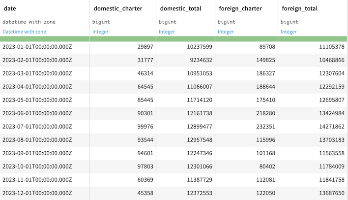
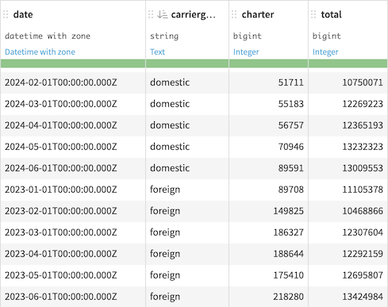

Format of time series data
###########################

Time series data usually has one of two formats:

- Wide format
- Long format

.. _ts_wide_format_label:

Wide format
=============
Time series data is in *wide* format if you have :ref:`multiple time series<ts_multiple_label>` and each distinct time series is in a separate column.

For example, given airline data from the `U.S. International Air Passenger and Freight Statistics Report <https://www.transportation.gov/policy/aviation-policy/us-international-air-passenger-and-freight-statistics-report>`_, the dataset consists of data for two air carrier groups — U.S. domestic air carriers and foreign air carriers. This data can be represented in wide format if you have one column representing data for each group (for example, the total number of passengers).

Furthermore, if each time series in this data has multiple dimensions (such as the total number of passengers and the number of passengers carried by charter flights), then you have multiple :ref:`multivariate<ts_multivariate_label>` time series data. The following figure shows a snippet of this data in wide format.

.. _ts_long_format_label:

Long format
============
*Long* format is a compact way of representing multiple time series.
In long format, values from distinct time series or from different dimensions of the same time series can be stored in the same column. Data in the long format also has an identifier column that provides context for the value in each row.

More commonly, values of the same variable from distinct time series are stored in the same column. Consider the previous example of multiple multivariate time series, the following figure shows a snippet of the data in long format. Notice that the *carriergroup* column acts as the identifier column for each time series in the data.

More generally, any data can be represented with only three columns: one for the timestamp, one for the identifier, and one for values. Applying this convention to the airline data, the identifier (*carriergroup*) would take one of these four values: charter_foreign, total_foreign, charter_domestic, and total_domestic.

.. _ts_format_conversion_label:

Data conversion
================

* You can convert data from long to wide by using the Pivot recipe

* You can convert data from wide to long format by using the :ref:`fold-multiple-columns` processor or the :ref:`fold-multiple-columns-by-pattern` processor.