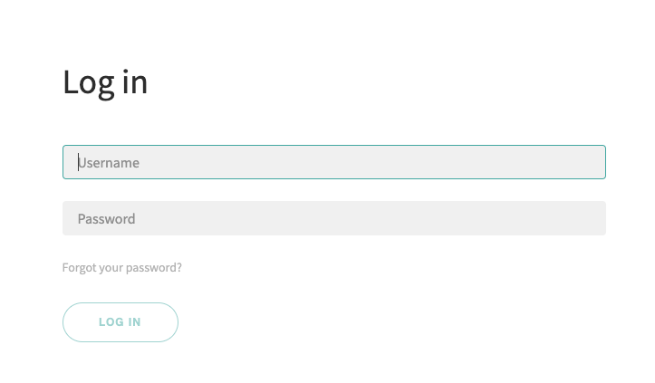

Cannot login to DSS
#####################

There are different cases when you have trouble logging in to your DSS instance

.. contents::
	:local:

You are using the Dataiku Cloud Trial
==========================================

ie: you didn't install anything and are connecting to a URL that ends with ``.i.cloud.dataiku.com``

You should have received credentials by email. If your credentials don't work, it can be caused by:

* You are trying to use IE or Edge to connect. These browsers are not supported by DSS and login will not work. Please use Chrome or Firefox. In case it's needed, `Portable Firefox <http://portableapps.com/apps/internet/firefox_portable>`_ can be run without installation
* The CapsLock key is enabled
* A change of keyboard layout (e.g. azerty/qwerty),
* A spurious space at the beginning or end of the login or password (be extra-careful when copy-pasting the password from the invitation email, or try to type it manually).

If none of this works or you have not received your credentials, please :doc:`contact us </troubleshooting/obtaining-support>`

You are using DSS Free Edition
===============================

You are faced with the DSS login screen

This screen prompts you to login to DSS, using your DSS account. By default, the credentials for this account are:

* login: **admin**
* password: **admin**

You can change the password in the account settings. You need this account, for instance, each time you clear your cookies, change browser, or restart DSS.

(For the Enterprise Edition of DSS, which allows collaborative features, there are several DSS accounts: one per user.)

If your credentials don't work, see the section below for suggestions.

You are using DSS Enterprise Edition
======================================

Users of the Enterprise Edition have only one account, created by the DSS administrator. She should provide you with a username and password. If your credentials don’t work, see the section below for suggestions.

Your credentials don't work
============================

If your credentials don't work, it can be caused by:

* You are trying to use IE or Edge to connect. These browsers are not supported by DSS and login will not work. Please use Chrome or Firefox. In case it's needed, `Portable Firefox <http://portableapps.com/apps/internet/firefox_portable>`_ can be run without installation
* The CapsLock key is enabled
* A change of keyboard layout (e.g. azerty/qwerty),
* A spurious space at the beginning or end of the login or password

If none of this works or you have not received your credentials, your DSS administrator (which may be you) needs to reset the password for this account

Resetting a forgotten DSS password
====================================

.. note::

	This procedure is only valid if you are using a local login. If you are using SSO or LDAP login, you need to reset your SSO or LDAP password.

If you still have access to DSS
---------------------------------

Login as a DSS administrator, then go to Administration > Security > Users. Select the user to edit, enter a new password and save it.

If you have lost all access to DSS
------------------------------------

This can happen if you have the lost the password for the sole admin account (which is the case by default, when you install DSS, there is a single admin account called **admin**).

To reset a DSS local password, you need to have have command-line access to the server, for instance through SSH. DSS must be running.

Reset the password with the following commands:

.. code-block:: bash

    cd DATA_DIR
    ./bin/dsscli user-edit --password NEW_PASSWORD LOGIN

Where:

* ``DATA_DIR`` is the path to your Dataiku data directory
* ``LOGIN`` is the username whose password needs to be reset
* ``NEW_PASSWORD`` is the new password.
