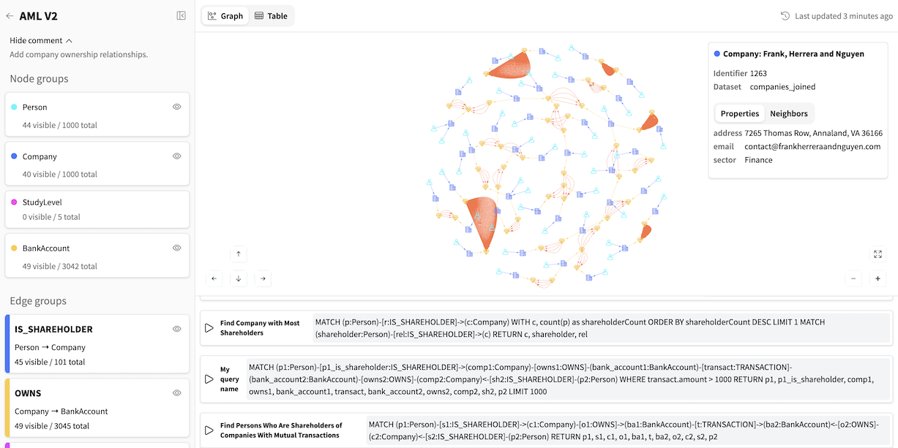

Explorer webapp
###############

Overview
--------

The Visual Graph **Explorer** is a read-only Dataiku webapp designed for business users and analysts to perform in-depth visual exploration of graphs managed in the Dataiku Flow.

.. note::
    
    **Get started** by following this `Explorer webapp tutorial <https://knowledge.dataiku.com/latest/ml-analytics/visual-graphs/tutorial-visual-graph.html#explorer-s-journey-for-non-technical-users>`_.

**Key features**

-  | **Schema overview**
   | View the graph's structure, including all node and edge groups.
-  | **Interactive exploration**
   | Visually navigate the graph, expand node relationships, and inspect nodes and edges properties.
-  | **Saved queries**
   | Execute a library of saved Cypher queries prepared by data scientists to answer common business questions.
-  | **Ad hoc querying**
   | Write and run custom Cypher queries directly within the interface with schema-aware autocompletion.
-  | **Query generator**
   | Use a built-in LLM assistant to generate Cypher queries from natural language questions.

.. note::

    All schema design, data mapping and visual customization are performed beforehand in the :doc:`Visual Graph Editor <./editor-webapp>` webapp.

Settings
--------

**Graph databases**
    * **Folder(s) containing the graph databases**: select one or multiple Dataiku Folders containing graph databases.

**AI Assistance**
    * **LLM Connection to use (Optional)**: select a LLM connection to enable the AI-powered Query generator. It helps users construct complex Cypher queries using natural language.
    * **LLM History Dataset (Optional)**: select the dataset storing the history of all questions asked by users in the Query generator. It can be used for auditing or analysis.

**Advanced Settings**
    * **Cypher Query Timeout (seconds)**: set a maximum execution time for queries run within the Explorer. This acts as a guardrail to prevent resource-intensive queries from impacting performance.
    * **Log Level**: configure the verbosity of the logs. Select **INFO** for standard operational logging (recommended for production) or **DEBUG** for detailed diagnostic information while troubleshooting issues.

.. note::

    Not configuring optional settings will simply disable the associated feature.

Visual Graph Explorer Interface
--------------------------------

Landing Page
~~~~~~~~~~~~

The landing page displays a list of all available graphs present in the selected graph database folders.
Key information, such as the last build time, is shown for each graph to indicate data freshness.

Graph Exploration Page
~~~~~~~~~~~~~~~~~~~~~~

Left-side panel
***************

Graph information
^^^^^^^^^^^^^^^^^
The top of the panel displays the graph's name, its last build time, and the comment associated with its published configuration.

Groups
^^^^^^
All node and edge groups are listed with their respective colors.

Graph statistics
^^^^^^^^^^^^^^^^
For each group, two types of counts are shown:

- **visible**: The number of nodes/edges currently displayed.
- **total**: The total number of nodes/edges for that group in the entire graph database.

View controls
^^^^^^^^^^^^^
For each node and edge group, you can toggle its visibility on or off to show or hide all elements of that group in the current view.

Bottom panel
*******************

Saved queries tab
^^^^^^^^^^^^^^^^^^^
The Saved queries tab contains a list of pre-built queries. They can be executed to see the results rendered as a graph or a table.

.. note::

    These queries are prepared by Data Scientists in the :doc:`Editor <./editor-webapp>` webapp.

New query tab
^^^^^^^^^^^^^^^^^^^^^^^^^^^
The **New query** tab provides a powerful editor with schema-aware autocompletion to write and execute your own Cypher queries.

Query generator tab
^^^^^^^^^^^^^^^^^^^^^^
For complex queries, the **Query generator** tab allows you to ask a question in natural language.
The AI assistant will translate your question into a Cypher query that you can then execute.

Central panel
*******************
In the **Graph** view, you can click on any node or edge to inspect its details, including its identifier, name, and properties.

When a node is selected, an additional **Neighbors** tab is available. It provides an overview of all directly connected nodes, displaying the total neighbor count and a breakdown by node group.

From here, you can selectively expand all neighbors or only those belonging to a specific group to explore the graph's structure interactively.
