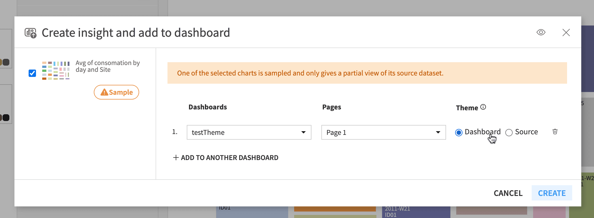

Visualization themes
####################

Dataiku visualization themes allow you to share your corporate colors
and guidelines across all charts and dashboards in all projects, and
apply a set of style changes to a chart or a dashboard in one click. All
users can customize themes for a specific chart or dashboard, and
administrators can save and share these customizations by creating new
themes. This article describes all you need to know to leverage
visualization themes.

Applying a theme
================

Follow these steps to apply a theme from the ones available in your
instance.

Locate the theme panel:

-  From a dashboard in edit mode, open the theme panel from the left
   bar.

    .. image:: img/theme-panel-from-dashboard.png

-  From a chart or chart insight in edit mode, open the “Themes” tab.

    .. image:: img/theme-panel-from-chart.png

There are two ways of applying a theme:

1. Select one of the available themes in the theme panel.
2. Click on the “Apply” button at the bottom of the theme customization
   interface (see the :ref:`Customize visualization themes` section for more
   information on theme customization).

Both actions behave identically.

Applying a theme will override your current chart or dashboard styles
with the theme styles. It’s possible to revert the application of a
theme for a few seconds using the “Revert” button of the snackbar
displayed at the top of the screen.

.. note::
    If you migrated existing projects to DSS 14.0.0, please note that the
    charts and dashboards from these projects will not automatically have
    a theme applied; they will retain their previous appearance prior to
    the migration.
    If you want them to use the styles of a theme, you can then open them
    and manually apply the theme of your choice.

.. _Customize visualization themes:

Customize visualization themes
==============================

Dataiku comes with built-in themes that reflect its visualization
default styles and a few popular alternatives. You can also customize
them as you wish.

To customize a theme, open the theme panel of your dashboard or chart,
and then click on “Customize” on the right of the current theme’s
miniature. From there, you can start editing the different theme
properties. To locally save and see your changes, click on the Apply
button at the bottom of the panel.

The customizations made and applied to a chart or dashboard only affect
this chart or dashboard and cannot be accessed by other objects. For
information about sharing your theme across all instances, please refer
to the :ref:`Create and manage themes` section below.

.. note::
    Copying a chart includes its visualization theme. If you want to
    reuse a chart’s theme without making the theme available to the whole
    instance, you can copy and paste this chart, and then modify it.

Theme colors and data color palettes
------------------------------------

Dataiku visualization themes allow you to choose from 8 to 20 theme
colors that will be used in various places.

| The first eight theme colors and their automatically generated lighter
  and darker variants will be used to populate all color pickers in
  charts and dashboards. This allows you to further customize your chart
  or dashboard while still following your theme styles.
| Some of the theme colors will be used to generate data color palettes
  used in charts. These palettes are updated whenever the theme colors
  change. They are customizable, and you can choose not to use them in
  favor of a built-in or a custom color palette of your choice.

The default data color palettes are generated using these rules:

-  All the theme colors are used to generate a discrete color palette.
   You also have the option to extend the discrete color palette with automatically
   generated variants for each theme color. Each variant is a darker or
   lighter version of a theme color, depending on which offers the best contrast.
   Darker variants are positioned before the base theme color, while brighter
   variants are placed after it, creating pairs of colors.
-  The first theme color and a lighter variation of it are used to
   generate a default continuous data color palette and a reverse
   alternative.
-  The first two theme colors are used to generate a divergent data
   color palette.

Typography
----------

Visualization themes allow you to customize the font family used in your
charts and dashboards. You can choose one of the font families that
comes with Dataiku or use a custom one by typing its name in the
selector.

.. note::
    If you wish to use a custom font family, please note that this
    font should be installed on every device from which you access Dataiku.
    If the font is not available, Dataiku will default to its own default
    font.

In addition to the font family, visualization themes allow you to
customize the default font size and colors for the hierarchical title
levels of your charts and dashboards:

-  “Page titles” affect the dashboard pages.
-  “Tile titles” affect the dashboard tile titles.
-  “In-chart titles” affect axis titles, KPI labels, and Gauge chart
   labels.
-  “Legends” affect chart legends.

Pages and tiles
---------------

Themes also allow you to customize the default styles for dashboard
pages and tiles, such as colors, spacing, and borders.

.. _Create and manage themes:

Create and manage themes
========================

Creating a theme starts with customizing an existing theme. Once you
have customized a theme, you may want to make it accessible across your
Dataiku instance. To do so, you will need to create a new instance
visualization theme. Custom instance visualization themes can also be
deleted, and theme definitions can be downloaded as JSON files.

.. note::
    If you customize a theme to save it as a new instance theme, we
    recommend you do so from a dashboard. A single chart won’t allow you to
    visualize all the theme properties before saving it, and instance
    visualization themes aren’t editable. Moreover, creating a theme from a
    dashboard allows you to apply your theme to different chart types at
    once.

JSON export
-----------

To get the JSON definition of a visualization theme, all users can open
the Customization interface in the Theme panel and click on the “Export
as JSON” button. This action is also available for administrators as a
secondary action to the “Save as new theme” button.

Creating a new instance visualization theme
-------------------------------------------

Only administrators can create instance visualization themes, and there
are two main ways to do so:

1. Access the chart or dashboard that uses the theme you want to share,
   open the customization interface, and click on the “Save as new
   theme” button at the bottom.

    .. image:: img/save-theme.png

2. Import the theme’s JSON definition in the Administration settings, in
   the Data Visualization > Charts & Dashboards section.

    .. image:: img/import-theme.png

Delete an instance visualization theme
--------------------------------------

To delete an existing instance visualization theme, navigate to the
Administration settings and open the Visualization > Charts & Dashboards
section. From there, you can delete any custom theme. Deleting a theme
won’t affect existing charts and dashboards using this theme, they will
continue to look the same until they are updated to use another one.

Select the instance’s default visualization theme
-------------------------------------------------

To select the instance’s default visualization theme, navigate to the
Administration settings and open the Visualization > Charts & Dashboards
section. From there, you can select the theme by clicking on its
miniature and saving the change.

The instance’s default theme will be used as the default theme for
future charts and dashboards, but selecting a new instance’s default
theme does not update existing charts and dashboards.

Control how chart insights are themed in dashboards
===================================================

Chart insights, like other charts in Dataiku, have their own theme that
you can choose and customize. However, when they are published in a
dashboard, you could expect them to use either their own theme or the
theme of the dashboard. This section details how to control this
behavior.

When publishing an existing chart to a dashboard, you can decide whether
to use the dashboard theme or the source theme, which is the theme of
the chart itself.

This option is then editable from the dashboard chart tile options.
Checking “Ignore dashboard theme” allows the use of the chart’s source
theme, while unchecking it allows the application of the dashboard theme
to this tile’s chart.

If you decide to use the dashboard theme to enforce consistency, it will
be applied over the chart styles. If you want to see your chart as it
appears on its own page and keep customizations made in the chart
“Format” tab, you must use the chart source theme.
