.. The screenshots in this section are taken from /projects/DKU_HAIKU/datasets/Orders_enriched_prep/visualize/ on the gallery or samplemaster

Basic Charts
######################

The Basic charts build visualizations based on the following types of columns:

- A required binning column, whose values are broken down into discrete values, or bins.
- A required summary column, whose values are aggregated for each bin.  Some basics charts allow multiple summary columns.
- An optional grouping column to produce subgroups of bins.

****

.. contents::
	:local:

Chart Layouts
---------------------

Bar
====

- The **Histogram** layout puts the binning column on the X axis, the summary column on the Y axis, and creates separate bars for each subgroup for each bin.

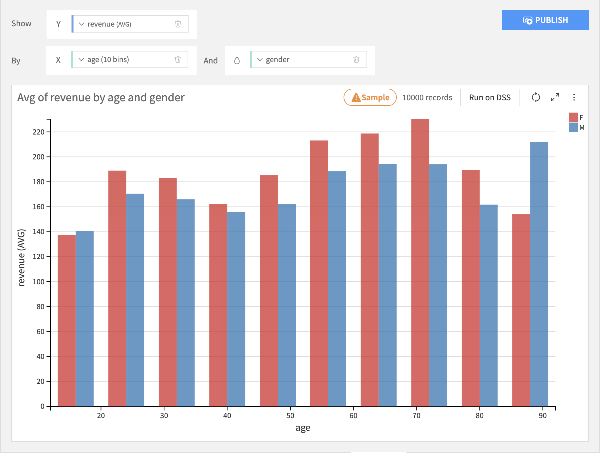

- The **Stacked** layout puts the binning column on the X axis, the summary column on the Y axis, and stacks each subgroup within each bin.

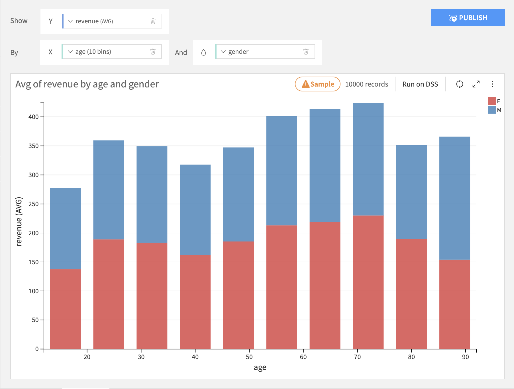

- The **Stacked 100%** is just like the Stacked layout, but the height of each bar is normalized to 100%.  This is useful for seeing differences across bins.

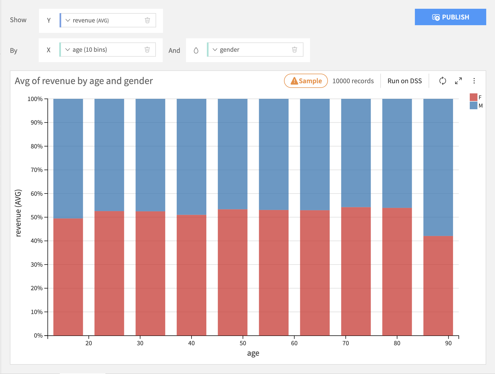

- The **Bars** layout puts the binning column on the Y axis, the summary column on the X axis, and stacks each subgroup within each bin.

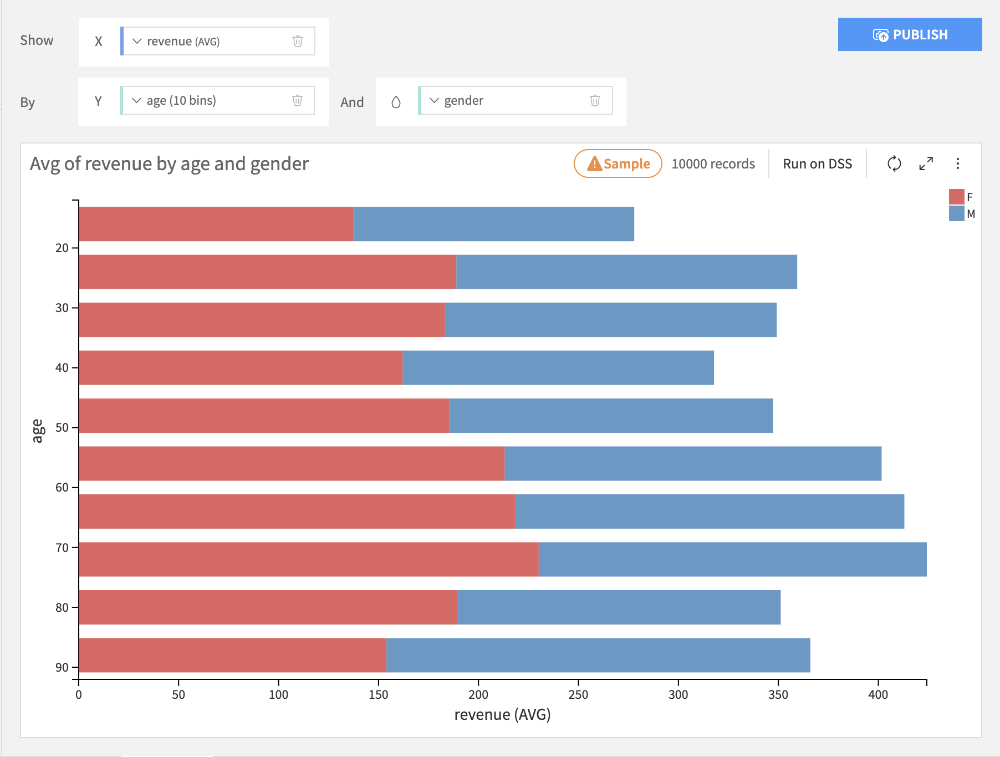

- The **Bars 100%** layout is just like the Bars layout, but the length of each bar is normalized to 100%.

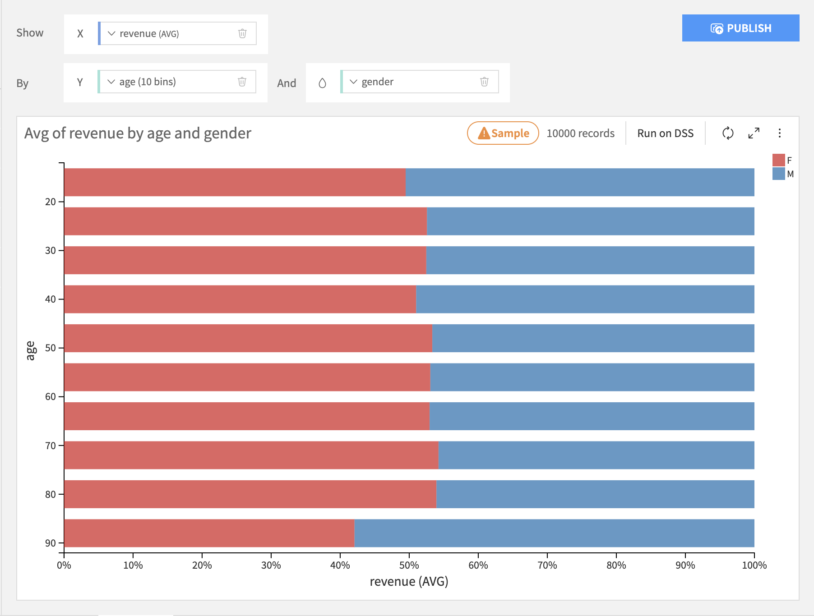

.. _line-charts:

Lines & Curves
================

Lines & curves charts are generally most useful for comparing multiple subgroups or summary columns.

- The **Lines** layout puts the binning column on the X axis, the line height column on the Y axis, and creates separate lines for each subgroup for each bin.

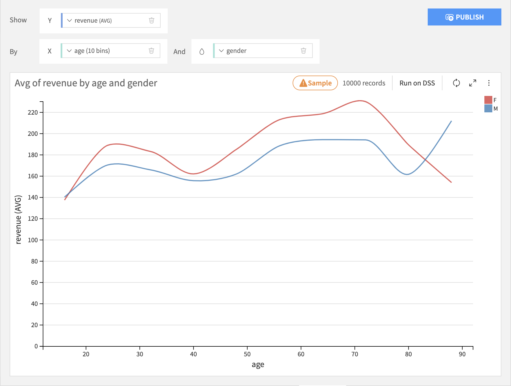

-  The **Mixed** layout puts the binning column on the X axis, for each height column on the Y axis and creates separate bars for each subgroup for each bin. You can choose whether to display it as a bar or line.

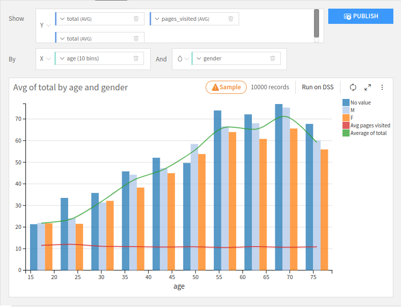

- The **Stacked Area** layout works roughly like a Stacked Bar chart, but it will create a smooth area instead of columns.

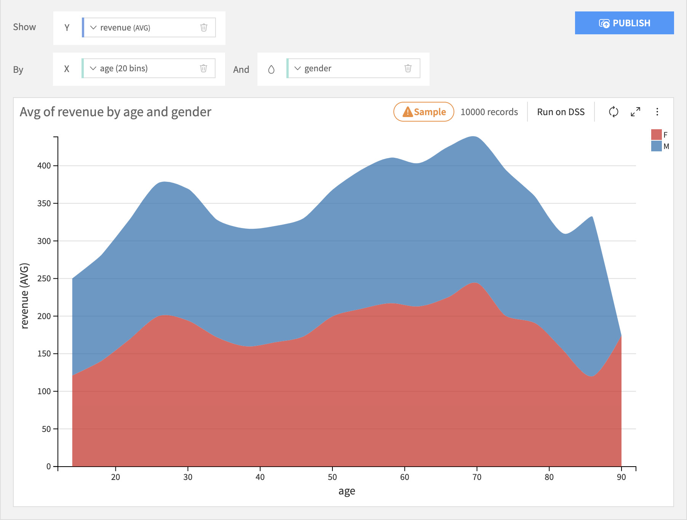

- The **Stacked Area 100%** layout works roughly like a Stacked 100% Bar chart, but it will create a smooth area instead of columns.

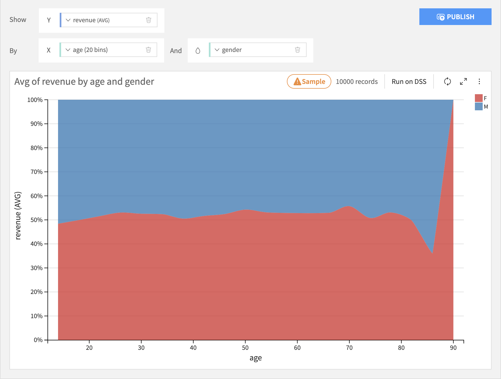

Pie & Donuts
=============

Pie & donut charts are generally most appropriate when there is no inherent ordering of the bins.

- **Pie** charts are like bar charts, but each bin is represented by a wedge in a circle, like a slice of pie.  The size of each wedge is proportional to the sum total of all wedges.  There is no subgrouping of wedges.

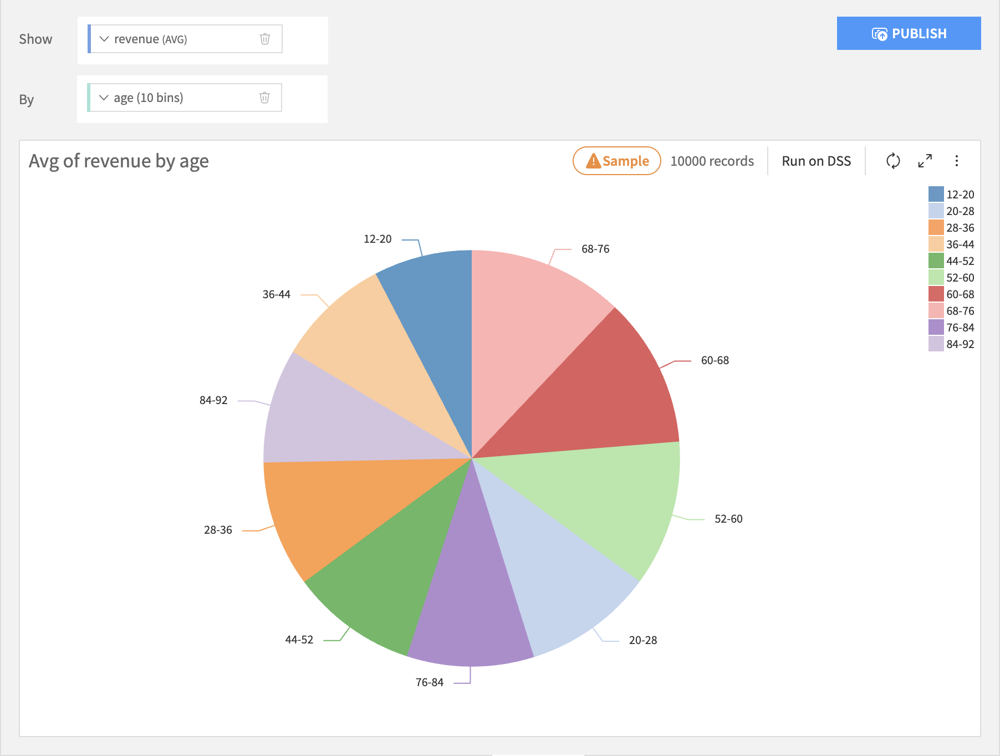

- **Donut** charts are like pie charts, but with the middle removed.

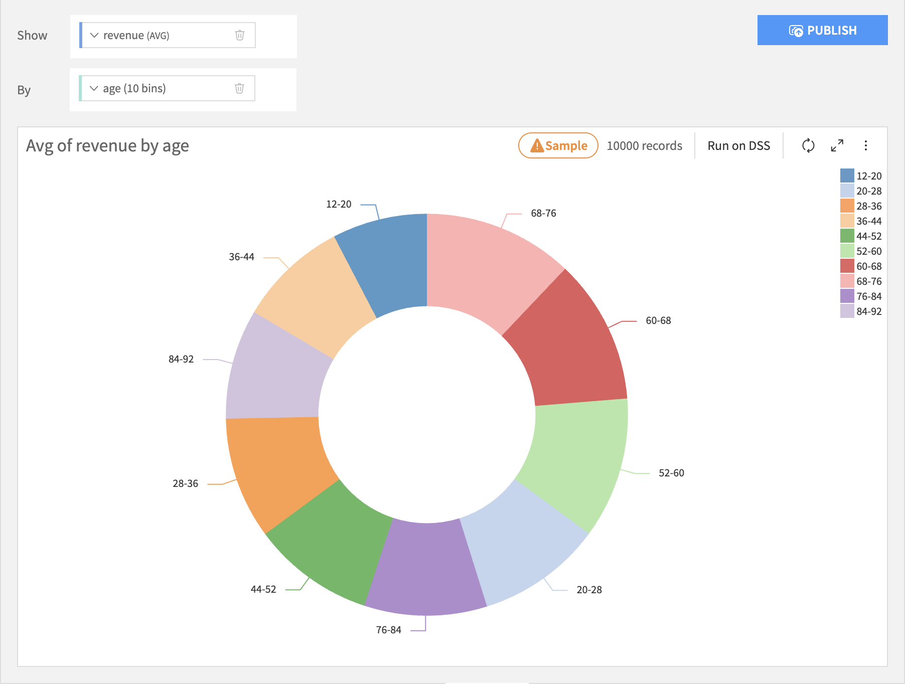

Column Processing Options
----------------------------

Binning Column
===============

Set the binning rules by clicking on the name of the binning column.

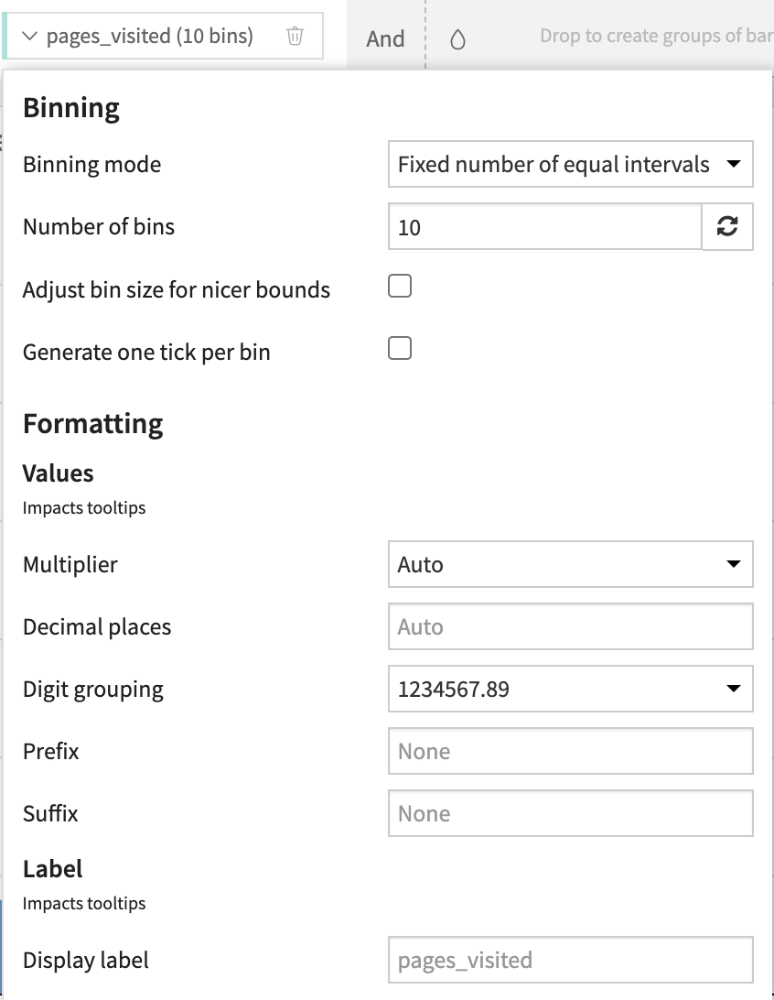

.. todo::
	Should we detail the options?

Summary Column
===============

Set the aggregation rules by clicking on the name of the summary column.

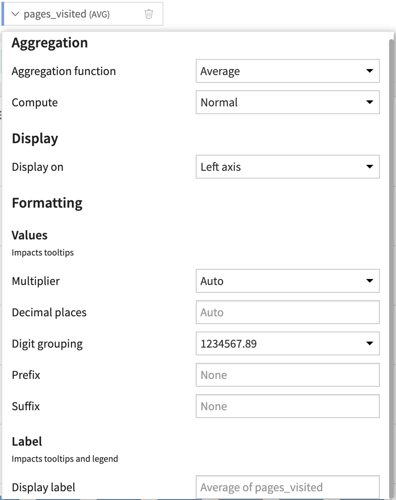

Grouping Column
=================

Set the subgroup sorting rules by clicking on the name of the grouping column.

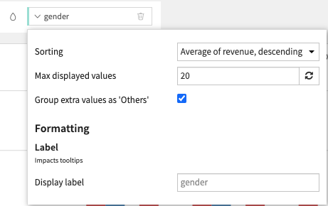

.. note::

	It generally does not make sense to use the "AVERAGE" aggregation when creating subgroups of of bars. Only aggregations that "naturally stack" should be used: SUM and COUNT.
