.. The screenshots in this section are taken from /projects/DKU_HAIKU/datasets/Orders_enriched_prep/visualize/ on the gallery or samplemaster

Map Charts
#########################

Map charts let you display a dataset containing geographic features on a world map.

The Map charts build visualizations based a required Geo column, whose values can be geographic points or geometries.

****

.. contents::
	:local:

Chart Layouts
---------------------

Scatter
========

- The **Scatter Map** layout plots a point at each individual geopoint.  It allows you to add optional Color and Size columns that change the color and size of the points based upon the column values.  The Size column must be numeric, but the Color column can be text or numeric.

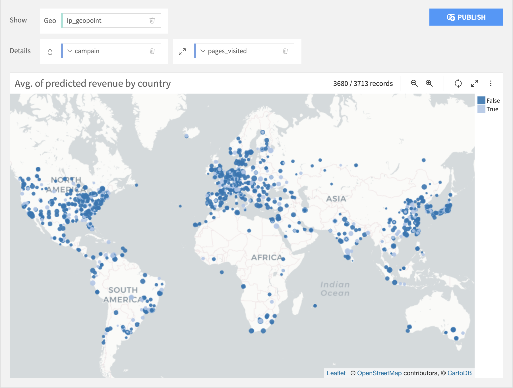

Geometry
========

- The **Geometry Map** layout works best with geometries, but will work with geopoints, in which case it is like a Scatter Map with no Size column. A Geometry Map can display several geographical columns.

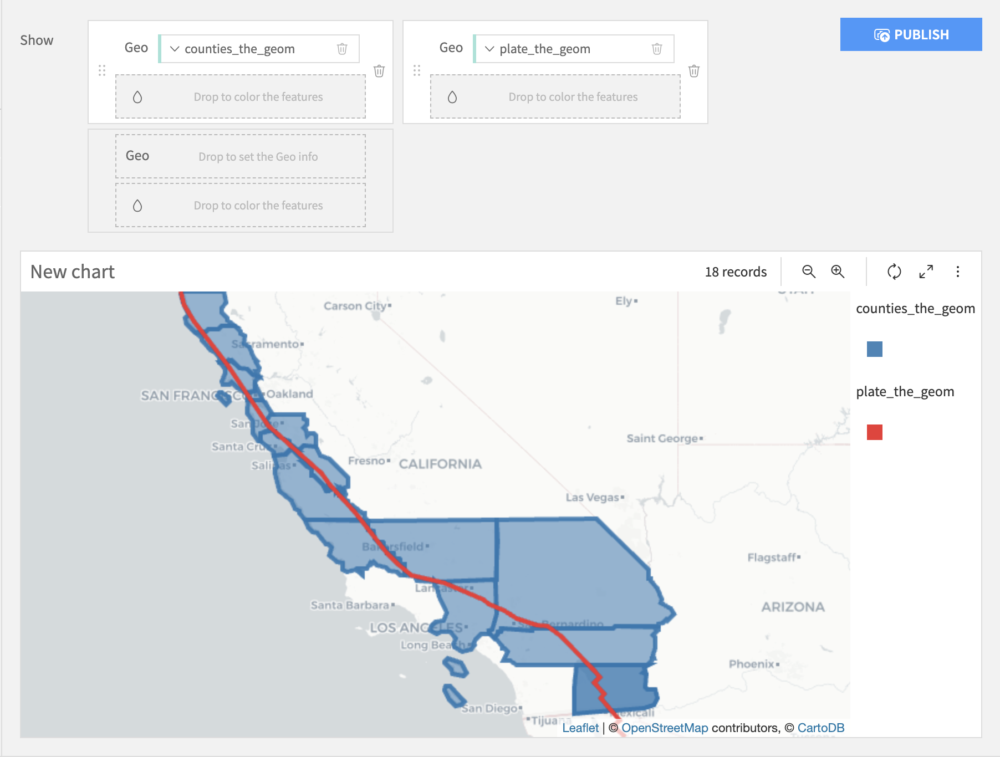

Choose the order of the geo layers
++++++++++++++++++++++++++++++++++

The order of the dragged geo columns determines the order of appearance of the geo layers on a map. Hence,

- if a geo column "geometry" is added on the **right hand side** of another geo column, the chart will display the layer "geometry" on top.
- if a geo column "geometry" is added **under** another geo column, the chart will display the layer "geometry" on top.

Therefore, the chart below plots :

- the column "isochrone_envelope" (orange) on top
- the column "city_geom" (red) in between the two layers
- the column "geoenvelope_walmart" (blue) in the background

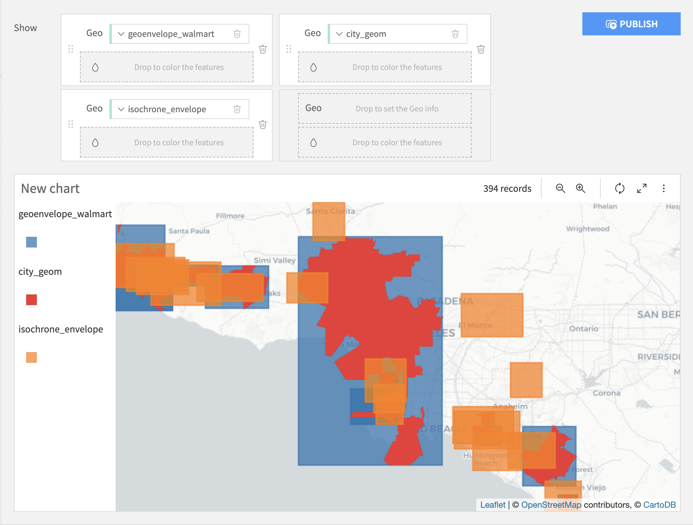

To change the order of the displayed layers, you may change the order of the geo columns by dragging and dropping them.

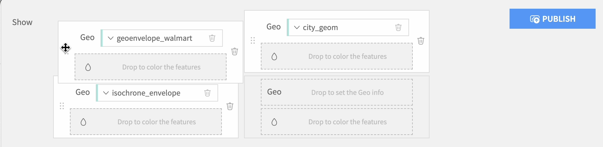

Set the colors
++++++++++++++

You can modify the colors by clicking on the "drop" button: |drop| of the geo column of your choice.

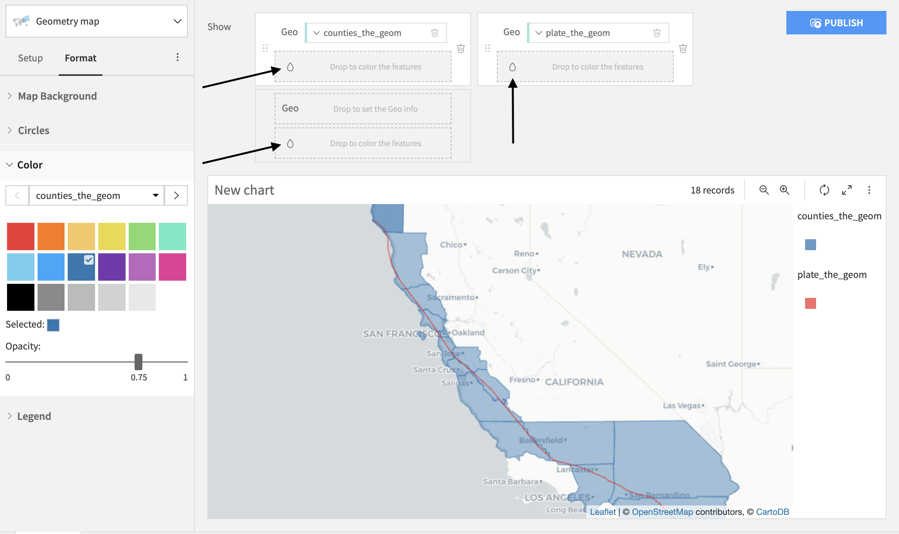

For each geographical layer, you can add a color column to change the colors of the displayed geometries according to their values. For example, the chart below colors each county based on their area.

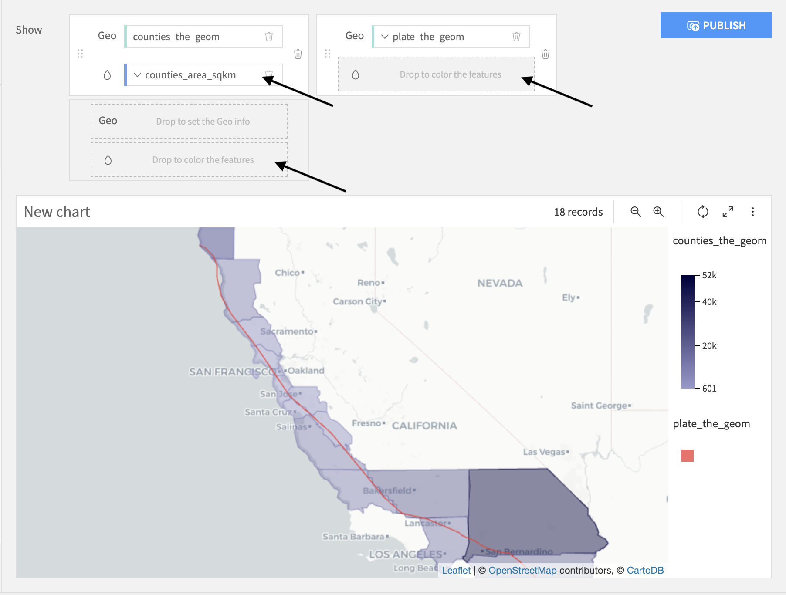

Aggregate geometries
++++++++++++++++++++
If two geometries are equal, a Geometry map plots them twice. If you want to display duplicated geometries only once, set the **Aggregate** option to Make Unique.

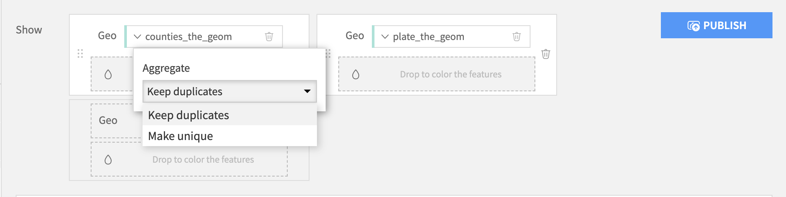

The "Make unique" option is only available for geometry columns without a color column.

Density
============

The **Density Map** layout displays the density of geopoints taking into accounts their spatial proximity and an optional quantitative metric.

The following parameters can be tuned:

-  Details: Optional quantitative column of the input dataset used as an additional point weight based on its value in the column.
-  Intensity (global for all points): A global parameter used as a multiplier for the weights of the points. Setting a high intensity will result in a less transparent chart.
-  Radius (global for all points): A global parameter setting the radius of each point, a higher radius will result in more overlapping between points and higher intensity in high density zones.

.. image:: img/density-heatmap.png

Binned
=======

The **Grid Map** layout plots the geographic locations as rectangular grids on the map.  It allows you to add an optional Color column that changes the color of the points based upon the column values.  The Color column can be text or numeric.

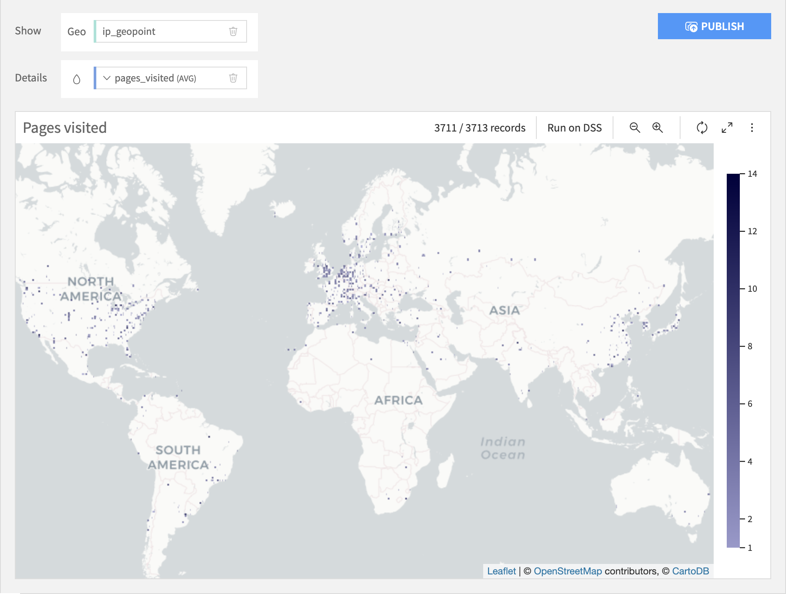

.. note::

    Map charts cannot be downloaded as images. To share map charts, publish them to a dashboard or take a screenshot of the map to generate an image of the map chart.  

Administrative
================

.. note::

	Administrative maps are considered a BETA feature. You might encounter issues while using it and we	do not guarantee that this feature will keep working the same way in future versions.

	To create Administrative maps, you must first install the `Reverse Geocoding plugin <https://www.dataiku.com/dss/plugins/info/geoadmin.html>`_. See :doc:`/plugins/installing` for details.

Administrative maps are aggregated charts: rows in your dataset are aggregated by administrative levels; for example:

* By country
* By region
* By city

You can change the "level of aggregation" by opening the settings of the Geo column.

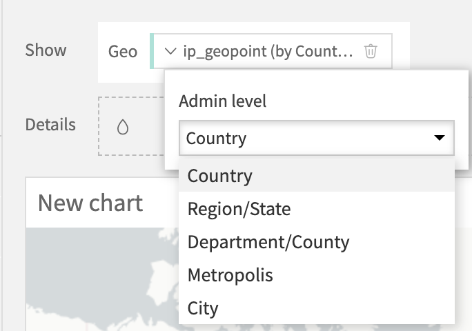

Two kinds of Administrative maps are available:

- In the **Bubbles** layout, each administrative level is represented by a circle. You can assign measures to both color and size.

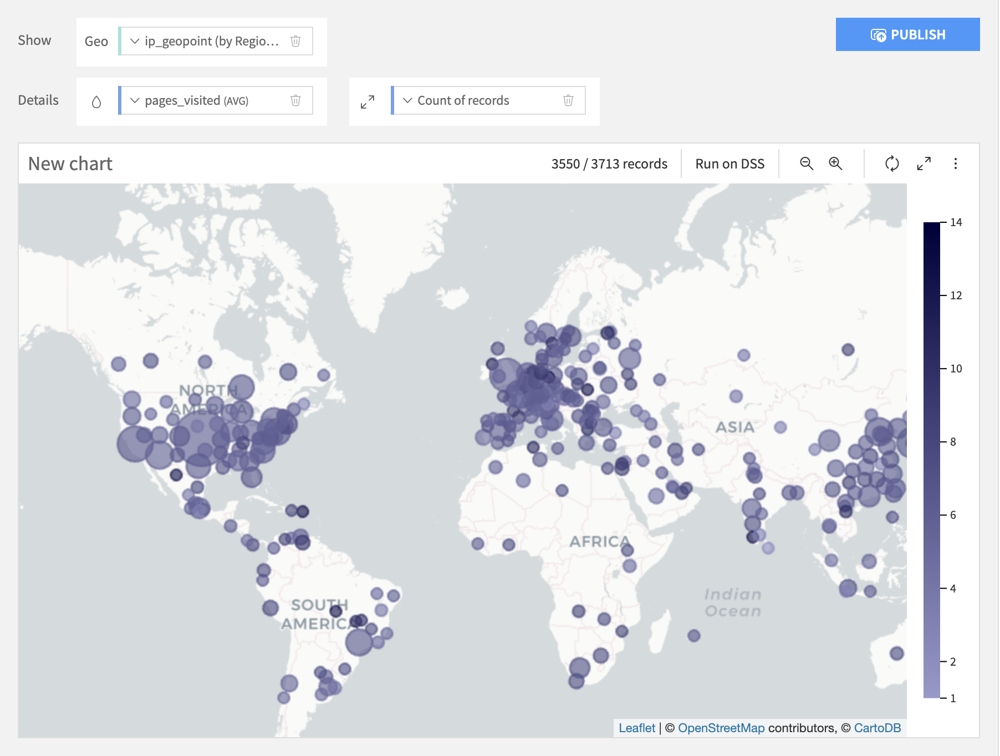

- In the **Filled** layout, each administrative level is represented by its real polygon. You can assign a measure to the color

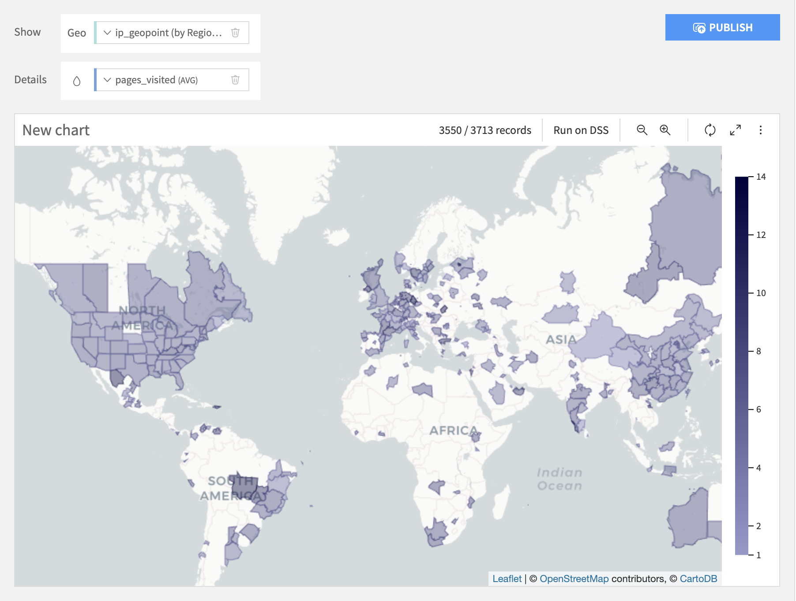

Geographic columns
---------------------

A geographic column is either a point or another kind of geometry. Valid geographic columns are detected as "Geopoint" or "Geometry" in the exploration component.

Geographic columns can be obtained in DSS:

* By reading a GeoJSON or Shapefile dataset
* By reading any dataset containing a column in `WKT format <http://en.wikipedia.org/wiki/Well-known_text>`_
* By applying a geocoding processor in a preparation script
* By applying a "Resolve GeoIP" processor in a preparation script

Map backgrounds
----------------

DSS comes pre-bundled with map backgrounds provided by Carto.  More map backgrounds can be added using DSS plugins:

* You can find in the Dataiku plugins `a plugin to add map backgrounds from Mapbox <https://www.dataiku.com/dss/plugins/info/mapbox-maps-backgrounds.html>`_ (requires a Mapbox API key)
* In addition, you can :doc:`create your own plugins to add other backgrounds </plugins/reference/charts-elements>`.
