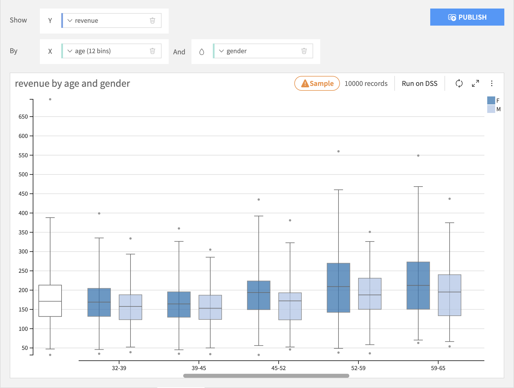
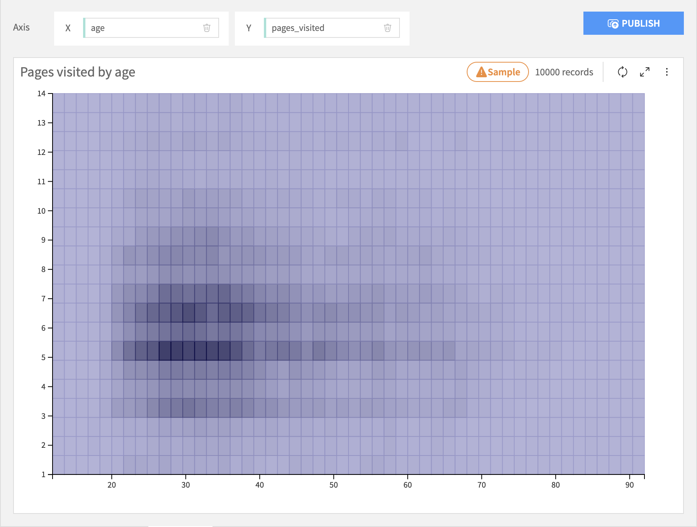
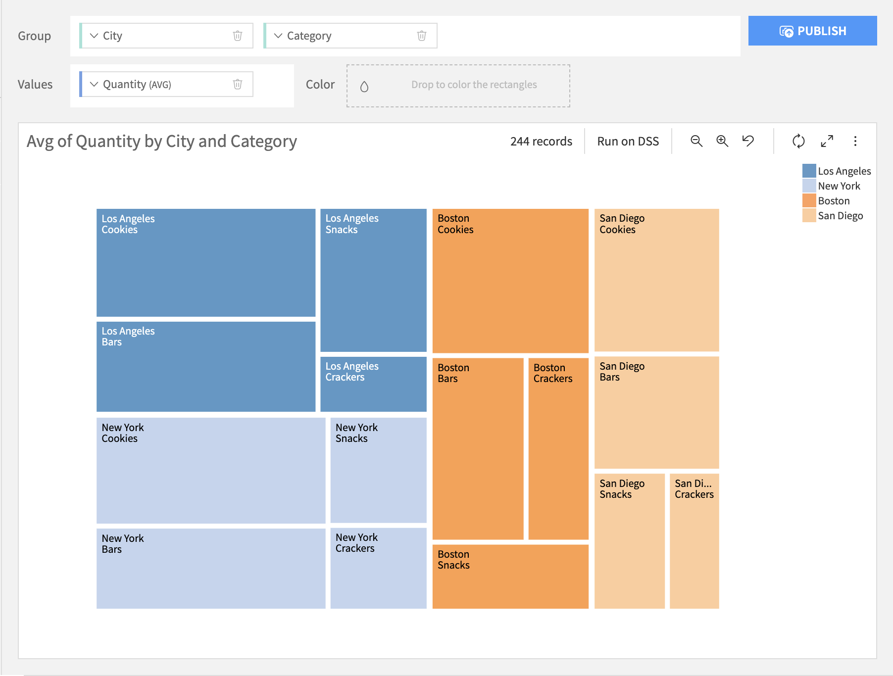
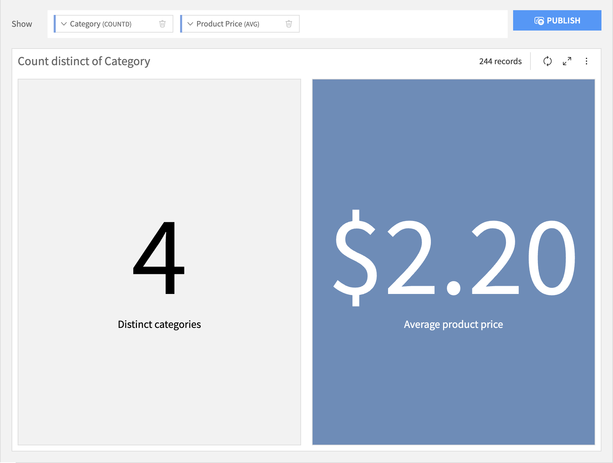
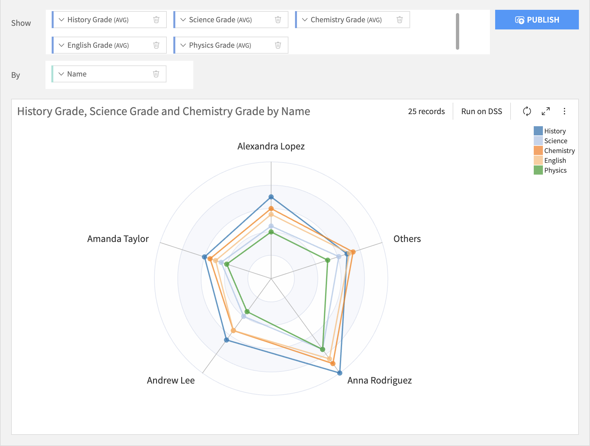
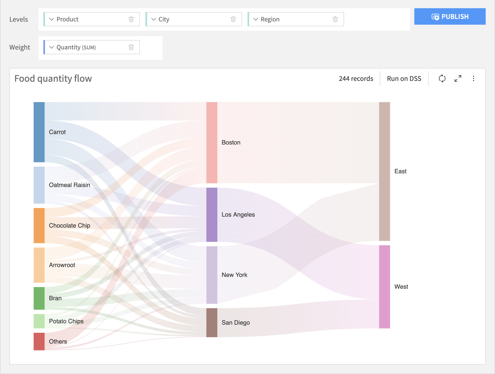
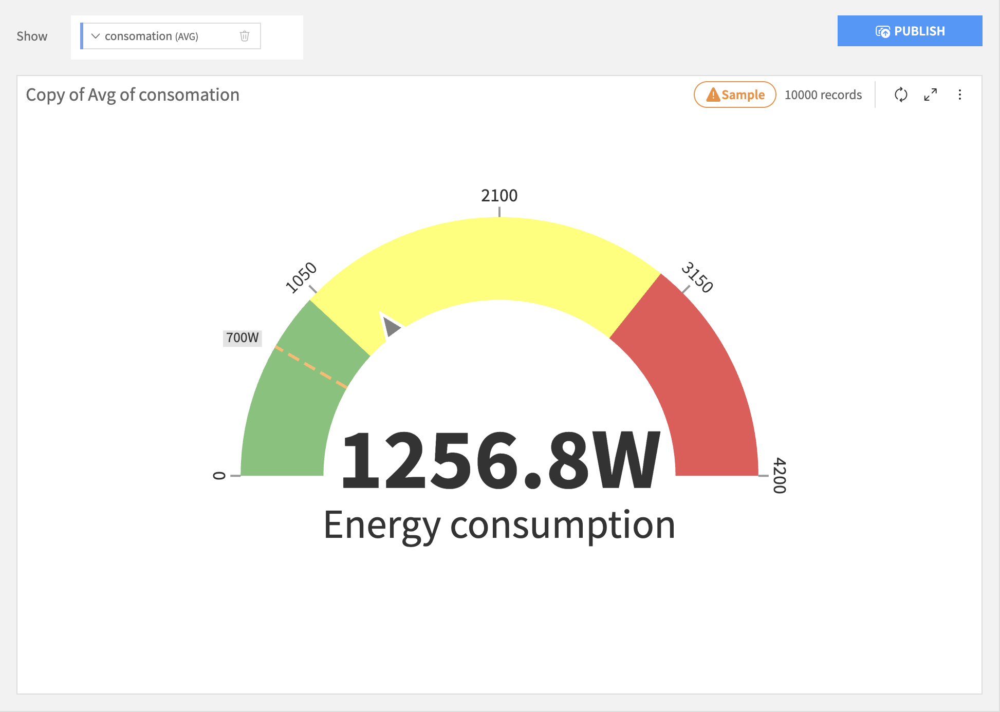

.. The screenshots in this section are taken from /projects/DKU_HAIKU/datasets/Orders_enriched_prep/visualize/ on the gallery or samplemaster

Other Charts
##############

These charts do not fit neatly into other classifications.

****

.. contents::
	:local:

Boxplot
========

Boxplots build a visualization that shows you the distribution of a required Y axis column, possibly broken down by the bins of an optional X axis column and creates separate boxplots for each subgroup for each bin on the color axis. The Y axis column must be numeric, the X axis column can be numeric or text.

2D Distribution
=================

The 2D Distribution chart builds a visualization that shows you the bivariate distribution of a required X axis column and a required Y axis column. Each column is binned and the resulting cells are colored by the relative density of rows in that cell.

Lift Chart
=================

.. warning::
	This chart type is deprecated. Lift charts are provided for models in Visual ML results.

Treemap
=================

Treemap charts build a visualization of the hierarchical structure of tree diagrams. Each parent node is represented by a rectangular area with its children nodes nested inside. The size of each area is dependent on the value of the corresponding node.

KPI
=================

Standing for "Key Performance Indicator", KPI charts build a simple value visualization for single or multiple aggregations.

Radar
=================

Radar charts are ideal for comparing multiple quantitative variable, each variable being displayed as a radial axis. The values of the same category are shown as polygon, of which each chart can have 1 or more.

Sankey
=================

A Sankey chart is used to depict the flow of resources, quantities, or values from one set of entities to another. It is a type of flow chart that illustrates data across different categories or stages.

Gauge
=================

The Gauge chart, also known as speedometer, is used to display data in a circular axis to demonstrate performance or progress. This axis can be colored to offer better segmentation and clarity.

