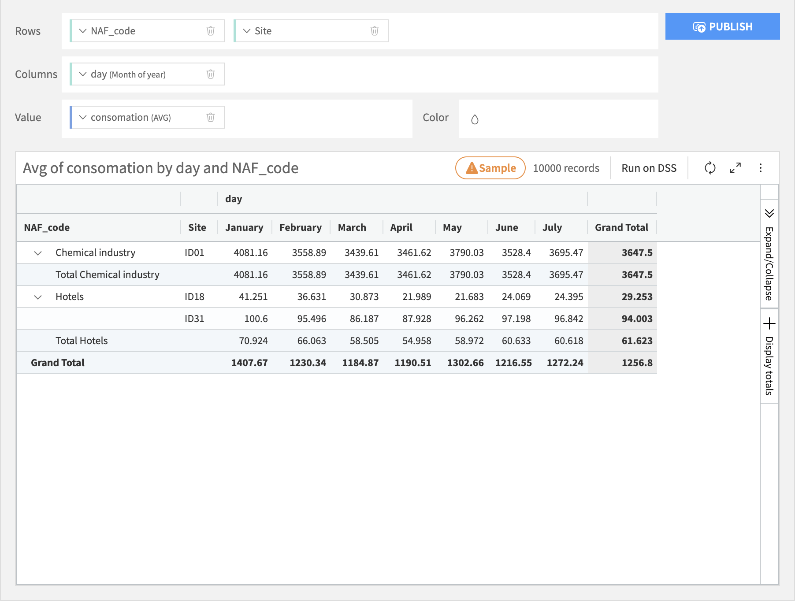
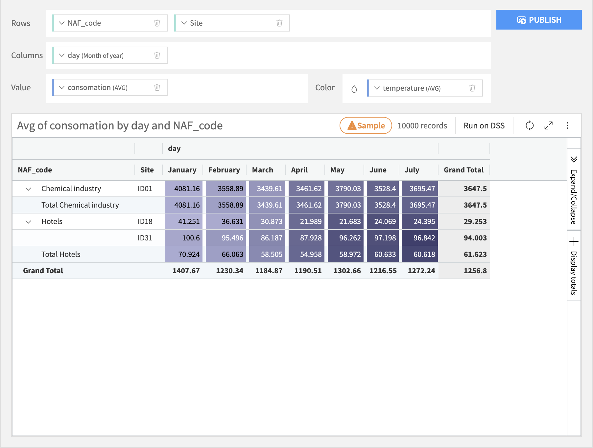

.. The screenshots in this section are taken from /projects/DKU_HAIKU/datasets/Orders_enriched_prep/visualize/ on the gallery or samplemaster

Tables
#######

Tables build visualizations based on the following types of dropzone:

- Rows dropzone, whose bins define how records are broken down along rows of the table.
- Columns dropzone, whose bins define how records are broken down along columns of the table.

.. note::

	| Either a Row or a Column must be specified, but at least one is required.
	| You can use as many columns as you want on a dropzone

- A required Content column (and optionally more than one), whose values are aggregated for each row/column bin.

Tables include an optional option that colors the table cells based upon the aggregated values of the Color column, like a heat map.

