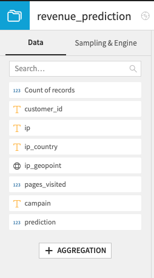
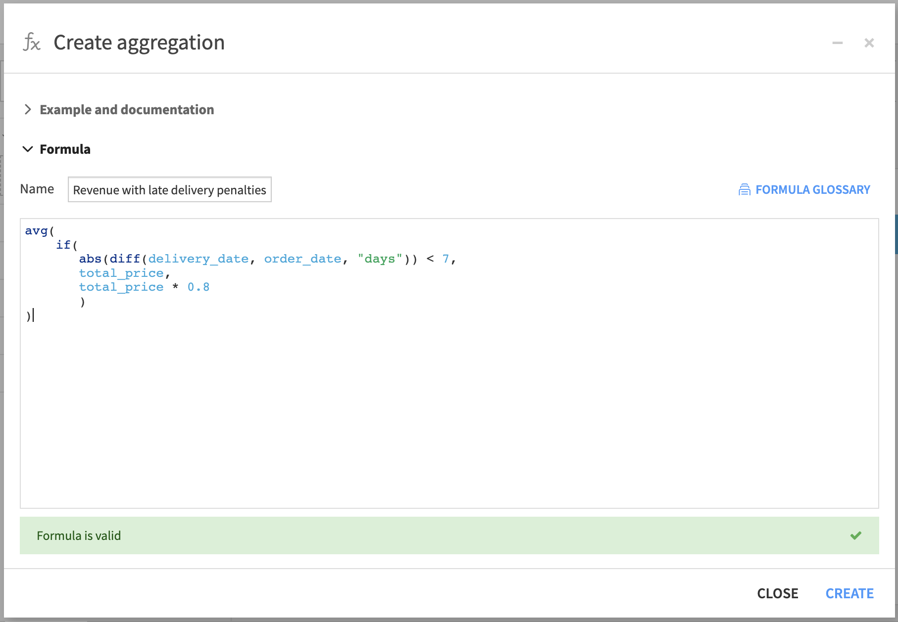
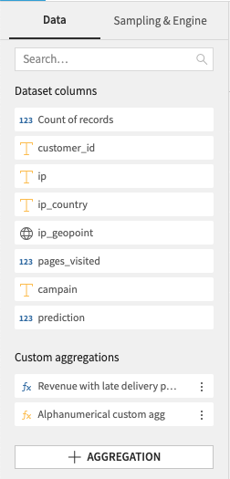
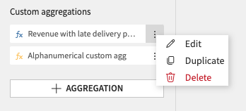
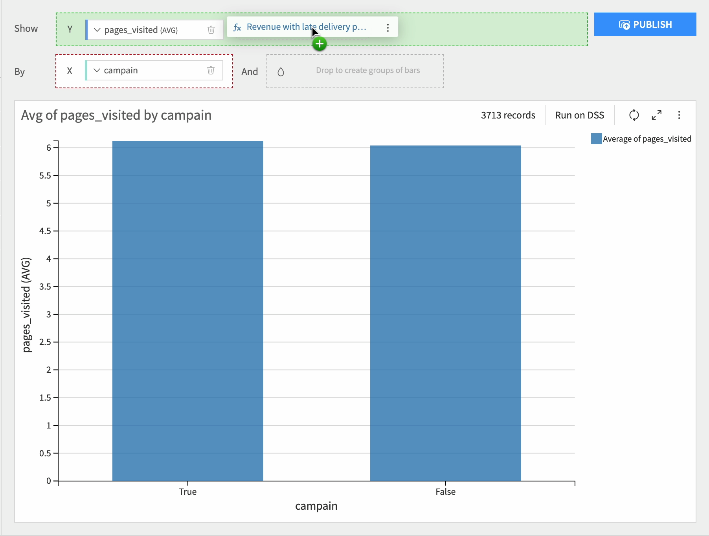

Custom aggregations
###################

Custom aggregations, also known as user-defined aggregations, allow you to use your dataset columns to create new aggregations. 
This means that you don't need to rely solely on predefined aggregation functions like `sum`, `count`, `average`, etc. 
Instead, you have the flexibility to combine existing columns, apply specific calculations, and define your own unique aggregations based on the requirements of your analysis. 
You can create unique aggregations that unlock valuable insights and enable you to perform advanced analysis tailored specifically to your data.

.. seealso::
    For more information, see the `Tutorial | Custom aggregation for charts <https://knowledge.dataiku.com/latest/data-viz/charts/tutorial-custom-aggregation.html>`_ article in the Knowledge Base.

.. contents::
	:local:

Creating and using custom aggregations
--------------------------------------

Underneath the columns in your dataset, there is a button that enables you to generate new aggregations.

This will open an editor panel, allowing you to create your own custom aggregation using the :doc:`Formula language </formula/index>`.
In addition to the functions and operators of the formula language, you also have access to all aggregations available on charts.

Once created, a custom aggregations is available at the bottom of your dataset columns.

Each custom measure can be edited, duplicated and deleted.

They can then be used as measures in your charts.

Limitations
--------------

Custom aggregations have specific limitations that need to be considered when using this feature. 
Firstly, custom aggregations must adhere to the structure of an aggregation. They cannot be simple calculations such as ``COLUMN_1 + 10`` as this would be as defining a new column rather than an aggregation.
Instead, they require aggregation operations to be applied as the result of your expression, using one of the available aggregations, such as ``count``, ``countd``, ``min``, ``max``, ``avg``, or ``sum``.
