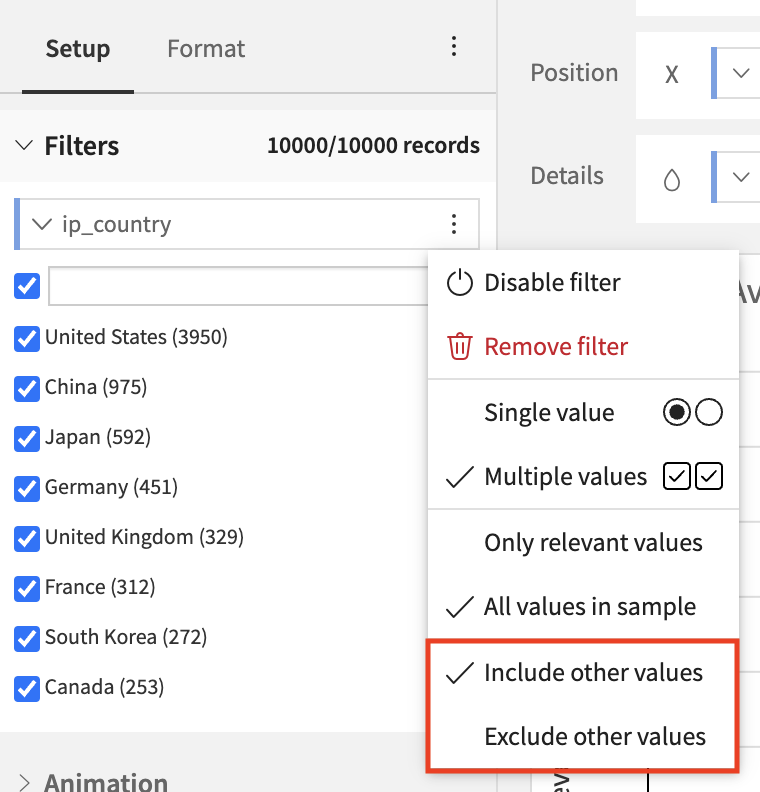
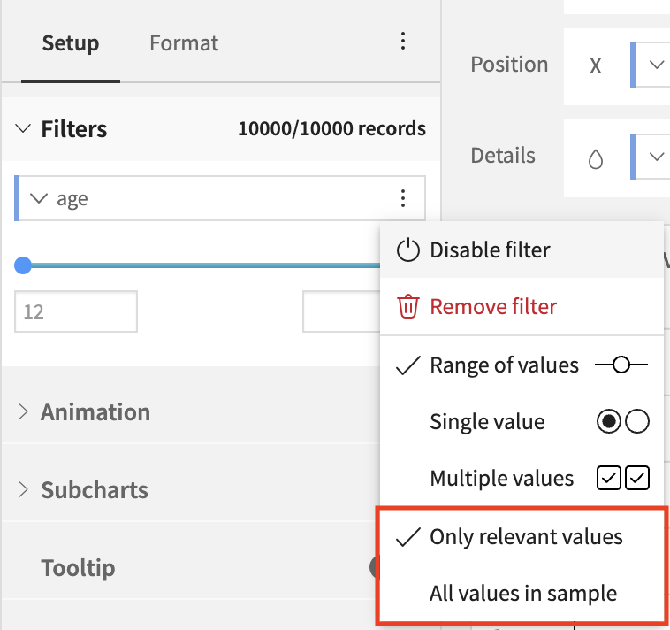

Filter settings
###############

Filter settings allow you to fine tune how filters are expected to behave.

****

.. contents::
	:local:

Include/Exclude other values
----------------------------

This option is available for alphanumerical filters and its main role is to allow to choose how values that will be added to the dataset in the future will affect the dashboard.
In exclude mode, new values will be filtered out while in include mode they won't.

.. note::
    For dashboard filters, this option also controls whether to display or not values that are present in a filterable insight but not in the filters tile. In exclude mode, these values are filtered out while in include mode they aren't.

    A value can be displayed in a filterable insight but not in the filters tile if the underlying datasets or sampling options are different.

Dashboards default behaviour is **Exclude other values**.
Charts default behaviour is **Include other values**.

Only relevant values/All values in sample
-----------------------------------------

This option is available for all filter types and allows to choose if:

* the values available in the filter should be restricted based on the other filters: **Only relevant values**.
* all values should be shown without taking into account the other filters: **All values in sample**.

Dashboards and Charts default behaviour is **Only relevant values**.
