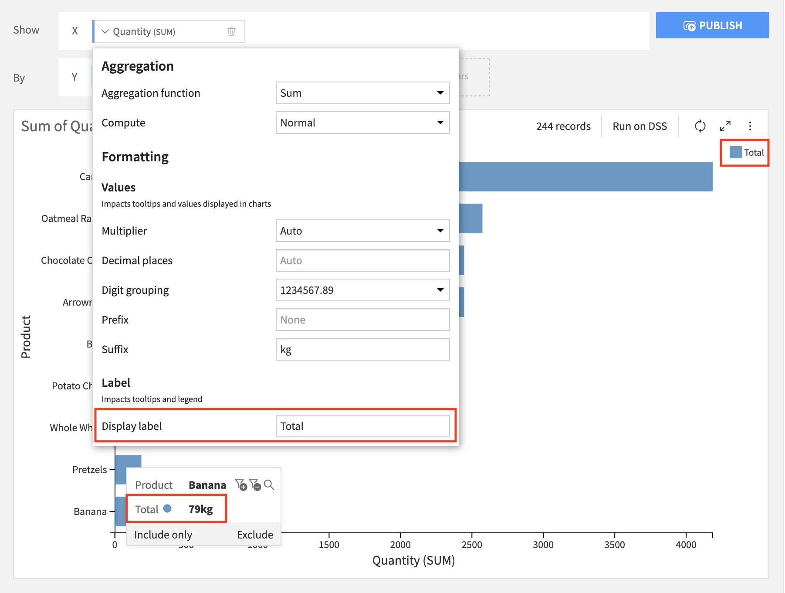
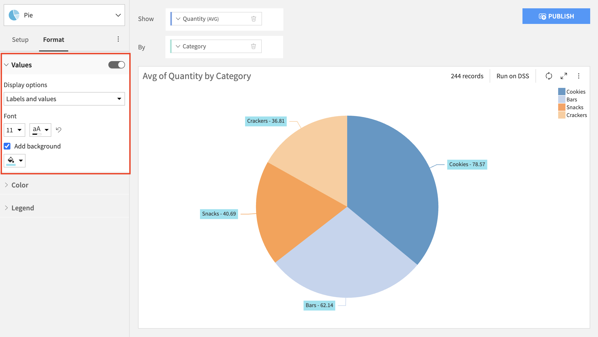
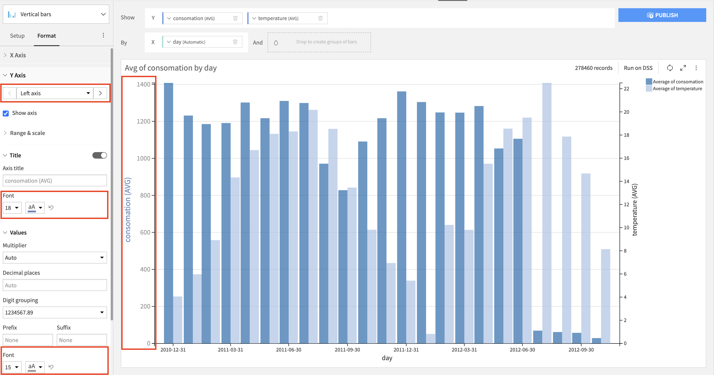
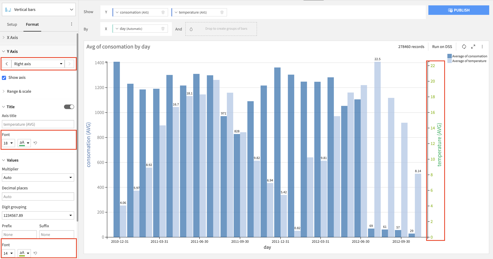
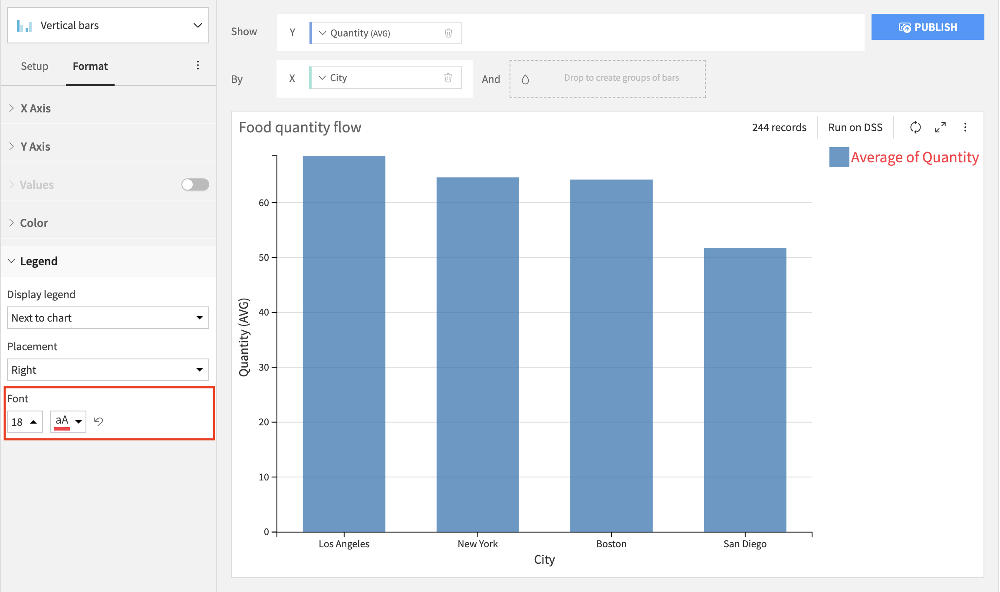
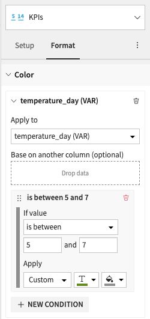
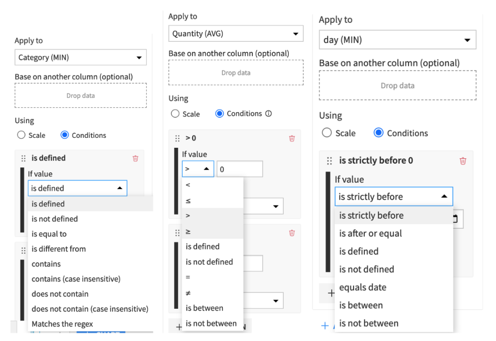
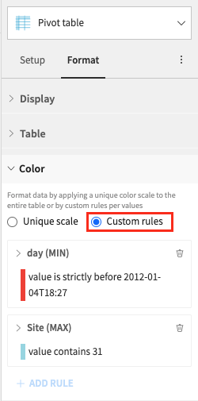

Formatting
##########

Formatting options are options that does not change how the chart data is computed but rather how it is displayed.

****

.. contents::
	:local:

Number Formatting
------------------

By default, DSS chooses how to format numbers based on available data for both axes and measures/numerical dimensions.

In order to give you more control over how these values are formatted, several formatting options are available:

- multiplier (thousands, millions, billions)
- decimal places
- digit grouping
- prefix
- suffix

Number formatting can be applied to:

- axes: the formatting is applied to the axis tick labels;

  .. image:: img/axis-number-formatting.png

- measures/numerical dimensions: the formatting is applied everywhere a value of this measure/dimension is displayed (eg in tooltips and in the legend).

  .. image:: img/measure-number-formatting.png

*Note: axes and measures/dimensions are independent, meaning that if you want consistency between the axes tick labels and the measure/dimension values you have to apply the same options to the axes and the measures/dimensions from their dedicated configuration menus.*

Display labels
--------------

The "Display label" option allows you to change how the field name displays in the chart 

Editing the "Display label" field will affect how that label is displayed in the chart:
- for measures: tooltips and color label will be updated;
- for dimensions: tooltips will be updated.

This option is available for most charts as soon as the measure/dimension name is displayed.

Display values/labels in chart
------------------------------

The "Display value in chart" and "Display labels in chart" options allow you to have the values and/or labels shown directly in the chart.
These options are checkboxes that are placed on the left side of the chart, in the "Values" section.

The "Display value in chart" option is available on the following charts:
- Vertical bars
- Vertical stacked bars
- Vertical stacked bars 100%
- Horizontal stacked bars
- Horizonal stacked bars 100%
- Pie
- Donut
- Treemap 

*Note: on the treemap chart, this option is present both in the "Values" section (concerns the column used as "Value"), and in each dimension's contextual menu (concerns the columns used as "Group").*

The "Display labels in chart" option is available for Pie and Donut charts.

Additionally, the values and labels displayed in chart can be customised. For all of the charts mentioned above, you can choose a font color, font size, add a background and change its color and opacity.
The exception is the treemap chart, where you can only customise the font size. Additionally, for all bar charts, both vertical and horizontal, you can select an overlapping strategy, specifically whether to hide overlapping values or display all of them.

Axes formatting
---------------

The axis formatting options concern axis ticks and titles. They allow you to change the font size and font color of axis ticks and titles (if shown in the chart)
These customisation options are applicable for all the charts that have axes, excluding the x axis on the boxplot chart. For the charts that allow multiple y axes, it is possible to format each axis separately.
These settings can be found in the Format tab.

Legend formatting
-----------------

The legend formatting options are available for all the charts that have legends. They allow you to change the font size and font color of the items in the legend.

Conditional Formatting (KPI and pivot table)
--------------------------------------------

This features allows you to color your chart with more granularity.
The coloring can be based on the values displayed on the chart themselves or on another column (when data is dropped in the "Base on another column" section).

.. note ::
  Once a column is selected in one rule's "Apply to", it cannot be selected by other rules

The available formatting conditions also depend on the type of data being used. Below are examples for alphanumerical, numerical, and date:

For the pivot table, the conditional formatting is located under the "Format" section, in the "Color" menu, when "Custom rules" is checked:

An individual scale can be used for each column or row, provided the values are numerical, or if "Base on another column" is used with a numerical column.
