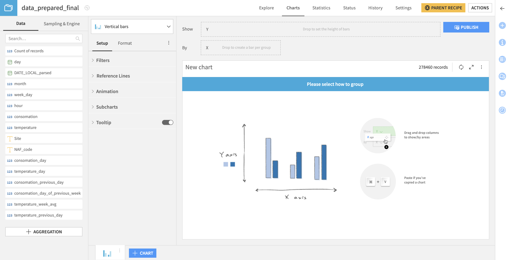

The Charts Interface
=================================

The Charts interface has the following components:

- The **Columns, Sampling & Engine panel** is a control with two tabs.

  - The Columns tab provides a searchable list of columns in the dataset that you can use to build charts.  A special *Count of records* column is always available.
  - The :doc:`Sampling & Engine <sampling>` tab allows you to set how the dataset is processed.

- The **Chart type selector** determines the form of the chart.  Choose from the :doc:`Basics <charts-basics>`, :doc:`Tables <charts-tables>`, :doc:`Scatters <charts-scatters>`, :doc:`Maps <charts-maps>`, or :doc:`Other <charts-other>` chart types.
- **Chart definition elements** define the contents of the chart.  The exact set of required elements varies by chart type.  Drag and drop columns from the Columns panel to the appropriate controls here.
    - Measures and dimensions settings can be found in this area. To access them, click the carret before the measure/dimension name. From this carret you'll be able to configure the element and access its :doc:`formatting options <formatting>`.
- The **Publish button** creates an :doc:`Insight </dashboards/insights/index>` from the Chart and publishes it to a :doc:`Dashboard </dashboards/index>`
- The **Common chart elements** refine the display of the chart. The **Setup** tab defines the data used in the chart and how the chart will be build; and the **Format** tab allows to customize and refine it. See :doc:`common` for details.
- The **Chart display** displays the currently defined chart.  You can edit the title of the chart by clicking on the pencil icon.
- The **Chart tabs** along the bottom of the display allow you to navigate between multiple charts created for the dataset.  You can duplicate or delete individual charts, or click **+Chart** to create a new chart from scratch.
