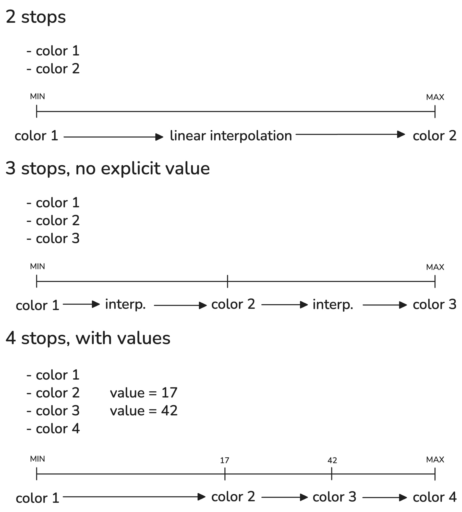
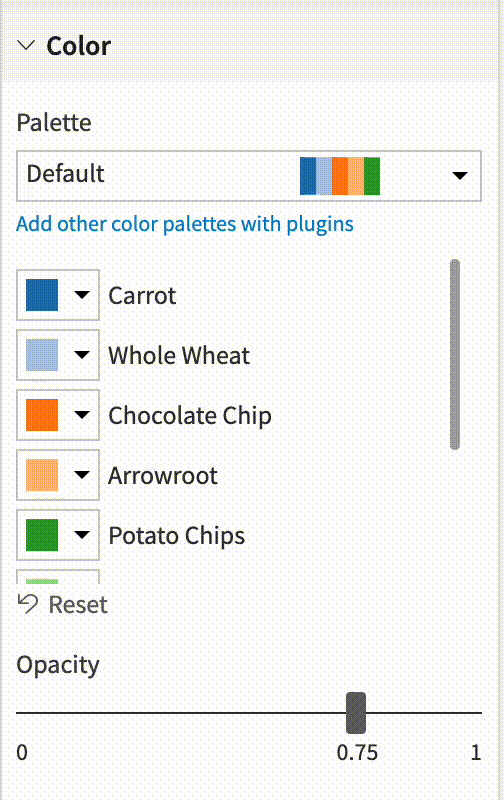

Color palettes
################

Palette types
===============

There are 3 color palette types in DSS:

Discrete palettes
------------------

Discrete palettes are used when the color dimension is categorical, either:

* By nature (it is a string)
* For numerical values, if the data is binned and aggregated (which is the case of most classical charts) or if the "treat as alphanum" option has been enabled
* For date values, if the data is binned and aggregated (which is the case of most classical charts) if a "categorical-type" breakdown has been selected. For example "day of week"

Discrete palettes define a fixed number of colors (ordered). DSS assigns a color per value. If there are more values than colors, DSS cycles between the colors.

Continuous palettes
--------------------

Continuous palettes are used when the color dimension is numerical (or date). For example, it is used on scatter plots.

Continuous palettes define a fixed number of colors. DSS interpolates between the values and the colors.
The most common case is to have two colors that define the colors of the extrema of the values. DSS makes a color interpolation between these.

You can also specify multiple color stops, and DSS will make interpolations by range between these stops. By default, DSS will equally split stops, but you can also assign an explicit value to each stop.

Diverging palettes
-------------------

Diverging palettes are conceptually very similar to continuous palettes and can be used in all situations where a continuous palette can be used. Diverging palettes have at least 3 colors, and you can easily select the value for the middle color. This is often used to have one hue for "positive" values, and one for "negative" values. Very often, the middle color is white.

A diverging palette is actually the same thing as a continuous palette with 3 stops and a custom value for the middle stop.

Quantization
============

Instead of fully linear interpolation, you can also request quantization: DSS will divide the color space and pick the middle color for each. This often provides more readable charts by providing a fixed color for a small range of values. Quantization can either be linear between the extrema of the values range, or based on quantiles of data points.

Scale mode
============

This option refers to the function that will be used to build the color scale.

* **Normal**: No function will be applied.
* **Logarithmic**: Suitable for exponential patterns and data spanning several orders of magnitude. Only applicable to positive values.
* **Square root**: Effective for reducing skewness and stabilizing variance. Typically used for non-negative data.
* **Square**: Emphasizes larger values. Useful in scenarios where distinctions among high values must be highlighted.

Custom palettes
================

DSS comes pre-bundled with a number of palettes of the 3 types. Some of the palettes in DSS include color specifications and designs developed by `Cynthia Brewer <http://colorbrewer.org/>`_.

You can create custom palettes on a per-chart basis, by selecting "Custom palette" in the palette selector. You can then select:

* the colors for a discrete palette
* the stops (and optional associated values) for a continuous or diverging palette

Palettes created this way are local to a chart and cannot be shared between charts

You can also create reusable charts by adding them to a plugin. DSS provides a quick way to transform a custom palette into a plugin palette. For more information, see :doc:`/plugins/reference/charts-elements`.

Meaning-associated palettes
===========================

If the column used for coloring has an associated custom meaning of "values list", you can associate a color to each of the values. DSS will automatically use the palette associated to the meaning (but this can be overridden).

Color assignations
==================

You can easily assign a palette color to a particular dimension.

The chart will get automatically updated.

.. note::
    Customizing these colors will override theme colors, even when a new theme is applied or the chart is published in a dashboard. Reset the customizations to use the theme colors.

