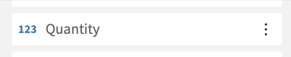
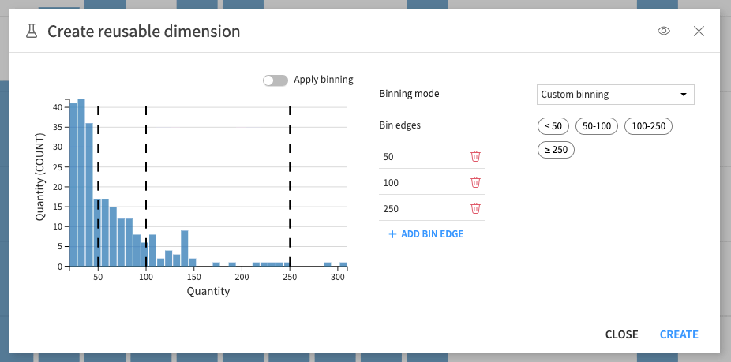
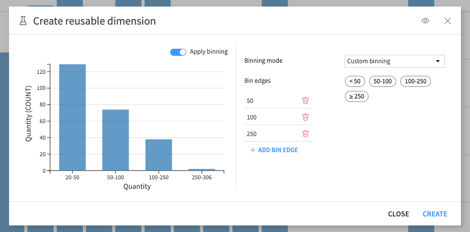
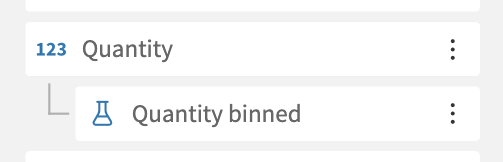
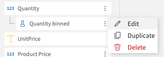
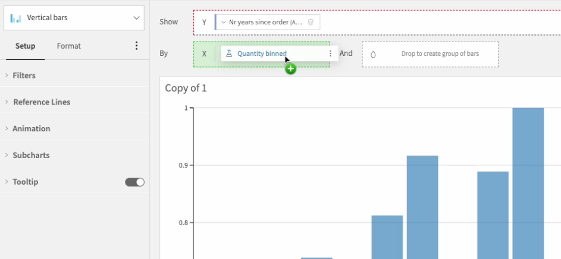

Reusable dimensions
###################

Reusable dimensions let you create and save binnings of your numerical columns, so you can reuse them easily in different charts.
Instead of repeating the same steps each time you want to bin a column, you can define it once as a reusable dimension and apply it anywhere.

There are different ways to bin your data with reusable dimensions:

* **Fixed number of equal intervals**: split the column into a chosen number of evenly sized bins.
* **Fixed-size interval**: define how wide each bin should be, and we will create bins to cover the whole range.
* **Custom binning**: manually set the exact edges you want for each bin.

Creating and using reusable dimensions
--------------------------------------

To create a reusable dimension, click the three-dot menu next to a numerical column, and choose the option to create a reusable dimension.

This will open an editor panel where you can define your binning and adjust a few options. 
From this panel, you can also visualize the distribution of the column and preview how your current binning setup will be applied.
This helps you fine-tune the configuration before saving it as a reusable dimension.

Once created, a reusable dimension appears under its associated numerical column.

Each reusable dimension can be edited, duplicated and deleted.

They can then be used as dimensions in your charts.

.. note::
    Editing a reusable dimension that is used in multiple charts will automatically update it everywhere it is used. Similarly, deleting a reusable dimension will remove it from all charts where it was used.