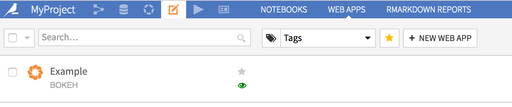

Introduction to DSS webapps
=============================

Web apps are custom applications hosted by DSS. Webapps can be used to write advanced visualizations or custom applicative front ends.

DSS allows you to write 4 kinds of web apps.

"Standard" web apps
---------------------

A standard webapp is made at least of HTML, CSS and Javascript code that you can write in the DSS webapp editor.
DSS takes care of hosting your webapp and making it available to users with access to your data project.

The Javascript code that you write has access to various DSS APIs to fetch data from datasets.

In addition, your webapp can contain a Python backend. The Python backend has access to the whole DSS public and internal Python APIs and can thus query datasets, perform SQL queries, or do all kind of administrative tasks (provided the user running the webapp has sufficient permissions).

.. seealso::
    For more information, see also:
    
    - The `Tutorial | Standard HTML webapps <https://knowledge.dataiku.com/latest/data-viz/webapps/tutorial-standard-html.html>`_ article in the Knowledge Base.
    - The `Standard webapps (HTML, CSS, JS) <https://developer.dataiku.com/latest/tutorials/webapps/standard/>`_ section in the developer guide.

Shiny web apps
---------------

A Shiny web app uses the `Shiny <https://shiny.rstudio.com/>`_ R library. You write R code, both for the "server" part and "frontend" part. Using Shiny, it is easy to create interactive web apps that react to user input, without having to write any CSS or Javascript.

You write your Shiny code as you would outside of DSS, and DSS takes care of hosting your webapp and making it available to users with access to your data project.

In addition, the server R code has access to the whole DSS R API and can thus query datasets, perform SQL queries, or do all kind of administrative tasks (provided the user running the webapp has sufficient permissions).

.. seealso::
    For more information, see the `Tutorial | R Shiny webapps <https://knowledge.dataiku.com/latest/data-viz/webapps/tutorial-r-shiny.html>`_ article in the Knowledge Base.

Bokeh web apps
---------------

A Bokeh web app uses the `Bokeh <http://bokeh.pydata.org/en/latest/>`_ Python library. You write Python code, both for the "server" part and "frontend" part. Using Bokeh, it is easy to create interactive web apps that react to user input, without having to write any CSS or Javascript (Bokeh is the Python counterpart to Shiny).

You write your Bokeh code as you would outside of DSS, and DSS takes care of hosting your webapp and making it available to users with access to your data project.

In addition, the server Python code has access to the whole DSS Python API and can thus query datasets, perform SQL queries, or do all kind of administrative tasks (provided the user running the webapp has sufficient permissions).

.. seealso::
    For more information, see also:
    
    - The `Tutorial | Python Bokeh webapps <https://knowledge.dataiku.com/latest/data-viz/webapps/tutorial-python-bokeh.html>`_ article in the Knowledge Base.
    - The `Bokeh: Your first webapp <https://developer.dataiku.com/latest/tutorials/webapps/bokeh/basics/index.html>`_ article in the developer guide.

Dash web apps
---------------

A Dash web app uses the `Dash <https://plotly.com/dash/>`__ Python library. You write Python code, both for the "server" part and "frontend" part. Using Dash, it is easy to create interactive web apps that react to user input, without having to write any CSS or Javascript.

You write your Dash code as you would outside of DSS, and DSS takes care of hosting your webapp and making it available to users with access to your project.

In addition, the server Python code has access to the whole DSS Python API and can thus query datasets, perform SQL queries, or do all kind of administrative tasks (provided the user running the webapp has sufficient permissions).

.. seealso::
    For more information, see also:
    
    - The `Tutorial | Python Dash webapps <https://knowledge.dataiku.com/latest/data-viz/webapps/tutorial-python-dash.html>`_ article in the Knowledge Base.
    - The `Dash <https://developer.dataiku.com/latest/tutorials/webapps/dash/index.html>`_ section in the developer guide.

Example use cases
==================

Here are a few examples of how a DSS webapp can be used:

Custom visualizations
-----------------------

You want to build a kind of visualization that is not builtin in DSS, like a Sankey diagram. You start by creating a dataset with data in the proper format for your visualization, using the regular :doc:`DSS flow </flow/index>`.

You then create a webapp:

* Either a standard webapp, which uses *d3.js* to perform the visualization. The Javascript that you write mixes d3.js with the Dataiku API to fetch the data from the dataset.

* Or using a Shiny webapp: you only use R code to fetch the data from the dataset, build the UI, and use one of the numerous Shiny R packages to prepare your diagram.

* Or using a Bokeh or a Dash webapp: you only use Python code to fetch the data from the dataset and build the UI.

Applicative frontend
---------------------

You have created a segmentation model using DSS, and have used a scoring recipe to perform the segmentation on your whole customer base. You thus have a dataset with all your customers, stored in a SQL database. Now, you want your business users to be able to lookup a particular customer and get the associated segment. You can create a webapp to do that.

* Either a standard webapp: the webapp presents a HTML frontend with a form for looking up various customer information. The JS code of the webapp relays the form to a Python backend that uses the DSS SQL APIs to perform queries in the SQL database, identify the matching customers and return them to the frontend.

* Using a Shiny, a Bokeh or a Dash webapp to write only R (resp. Python) code.

